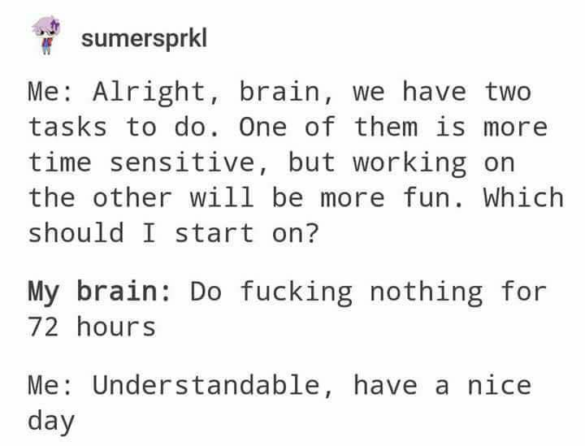

# “What’s the best move on the board?”

Imagine you have a supermegagigabrain. 400 IQ. 6000 elo. Stockfish ain’t got nothing on you. Let alone Magnus Carlsen, the world chess champion; he’s barely 3000 elo.

You decide to take on the world title. After a dozen moves, you arrive at this position.

<ChessProblem fen="1r3rk1/p1np1p2/b1pbp1p1/q7/4QB2/4P1P1/P1PNNPBP/1R2K2R b - - 0 20" moves="Rxb1 Nc1 Rxc1" orientation="black" :arrows="[{from: 'b8', to: 'b1', color: 'blue'}, {from: 'b1', to: 'b1', color: 'blue'}]" caption="This is interactive :)"/>

A backrank checkmate. By moving your rook to the other side of the board, you can win. Elementary.

Alas, moving your rook ALL THE WAY to the other side of the board takes quite a bit of effort, and you’re not feeling like it today. You’re kinda sick and tired. You’ll do it next move, after all you’ve got a 6000 elo brain, you have time.

You just push a random pawn.

Ten moves of “next move” later, the opponent sees the checkmate and defends it. “Damn”, you think, “I missed my opportunity! Whatever, there’ll be another one later on”. You lose the next two minutes grieving over your missed chance for an easy win.

It is then that you realize you are now in a losing position. The opponent is closing in on your king. It is mate in four.

<ChessProblem fen="1r3rk1/8/p1pN1p2/2npp1p1/b7/q1PQP3/3N1P1P/1R2K1R1 w - - 0 20" moves="Qg6 Kh8 Nf7 Rxf7 Rxb8 Rf8 Rxf8" caption="White to mate in %moves%" orientation="black"/>

You’re now extremely anxious. If only you made a move earlier on, if only you weren’t so lazy, you’d have won so easily. And now you’re just counting down the moves, praying that you won’t get annihilated.

The opponent makes a mistake. An unnecessary queen and rook move. You can win.

<ChessProblem fen="1r3rk1/8/p1pN1p1Q/2npp1p1/b7/q1P1P1R1/3N1P1P/1R2K3 b - - 0 20" moves="Rxb1 Ke2 Bd1 Kf1 Bf3 Nxb1 Qc1" caption="Black to mate in %moves%" orientation="black"/>

You see it, of course. But you’re too anxious. The clock’s running down. Plus, it again involves moving your rook all the way to the other side. You've already resigned to your fate a few moves ago, so you decide to take the easy, known way and lose just like you did all your prior games. You just do a random move, you just wish for this game to be over already.

The opponent continues his attack with a check. Opportunity lost. Again. You blame yourself for it.

Mate in 1.

<ChessProblem fen="1r3rk1/8/2pN1pQ1/p1npp1p1/b7/q1P1P1R1/3N1P1P/1R2K3 b - - 0 20" moves="Kh8 Rh3" orientation="black" :displaySuccessIcon="false" :moveDelay="250"/>

Checkmate.

It’s not your fault, you didn’t sleep well last night. You're kinda hungry. You’re quite anxious with the current politics. You have some unresolved trauma. You lack energy for anything, but certainly not for making excuses.

Maybe one day you’ll get past 150 elo.

----

Obviously, this is absurd. And yet it is how the vast majority of people, including probably you, play the game of life.

Life is a chessboard, and every second of every day you can move your arms, legs, and mouth to progress your position on the board.

You want this cute girl. What is the best move to get her?

1. Walk up to her and start rizzing her up.
2. You don’t know anything about rizz; you need to study first. You go on YouTube and search for basic tips about dating.
3. You have work to do on yourself before getting into a relationship. You forget about the girl and you do what you have to do.
4. You get limerent and start imagining your whole life together, orbiting around her in the hope she’ll make a move first. She gets interested, but eventually loses interest as you aren’t making any moves and not reciprocating her advances you are clueless about. She moves on and you blame yourself for another missed opportunity.

I think every single teenager is guilty of option 4, especially myself. Despite being smart enough to code an IDE at 16, I was too paralyzed by my fear to think rationally and determine the best move on the board.

We are in the age of the internet. There are endless (free) courses and videos on any subject. A free AI that has ingested the whole internet to which you can talk to at any time like an actual life coach.

Knowledge, and even intelligence, is no longer the bottleneck. Laziness, cowardice, and arrogance are.

But the biggest bottleneck is simply to not think about life like a chessboard.

## Viewing life logically

In retrospect, every single problem I’ve ever had in my life came down to me not using enough logic and succumbing to my emotions. Whereas I’ve never stumbled upon a situation where I used too much logic.

As with the girl example above, a very simple analysis would’ve revealed the best move on the board: I simply needed to study rizz, get a basic idea of how relationships work, then ask her out.

But I did not even analyze at all. I was too paralyzed by my emotions to even think of doing so.

You need to analyze EVERYTHING. This is how you win and get what you want.

Do not be swayed by emotions. View life as rationally and objectively as possible. Assess the state of the board without any bias.

Even if you are feeling hopeless, you should never resign or start throwing.

There is always a best move.

The board can always change, giving you an opportunity to win.

If you blundered your bishop, is the best move to next blunder your knight?
If you gave in and ate junk food, is the best move to next play video games because "the day is ruined"?

The only two things that matter are the current position and the time left on the clock.

This is what determines the best move on the board.

The absurdity of the human condition is that the hardest thing isn't to know the best move, but to make the best move.

## A solution for analysis paralysis

The following is a hard position. But even if you only have a rudimentary knowledge of chess, you can infer the following:

- The best move is probably moving the knight or the bishop.
- It very probably DOES NOT involve the pawn on A2 in the bottom left corner.

<ChessProblem fen="4k1N1/1p6/2p1Kp2/p1B5/2n5/8/P7/8 w - - 0 57" moves="Be7 Nd6 Nxf6" caption="White to play and win"/>

Time’s running out, you hope for the best and move your knight. It might not be the best move, but it is at least a good move.

Moving your pawn due to time pressure would be absurd. You know it’s nowhere near the best move. And yet, this is what everyone is doing.

{width=400}

Whether to flip a coin, to determine the optimal order of the tasks (the time-sensitive one first, obviously), or to just start on whatever task comes to mind, you need at all costs to find a way to annihilate this analysis paralysis.

Think about it. How many times did you fail to make the best move because it wasn’t obvious, and your brain defaulted to “if I can’t make the best move, I’ll make the worst move” and you just doomscrolled for hours?

Analyze the chessboard, determine the best move with regard to your goals, then do it regardless of your emotions.

Because it’s very rare that you look at the chessboard and think “you know what, the BEST thing I can do right now is jerk off”. Yet how many times did you do it in the past 2 weeks?

## “I need to think about it”

Do you really?

Chess grandmasters analyze thousands of potential positions, 30 moves deep, in a few minutes, and find the best one.

You are not the CEO of a multinational. (If you are, I’m flattered you’re reading this.) Your life is most likely very average and not complex at all, with problems that have already been solved a thousand times over.

Obviously, you do need to think about the moves you make. But there comes a point where you are clearly procrastinating and watching the 325th video on “the best business to start in §currentYear§” won’t get you any closer to your first dollar.

Just like in chess, you need to realize when you have done enough analysis and when you can make the move.

Otherwise, the clock runs out. And you lose.

And your clock has less time on it than you think.

## Full responsibility

There is absolutely no luck in chess.

If you lose, it was 100% your fault, and you have no choice but to accept it. YOU made a mistake. Even if it was just a tiny one many moves before.

No teammate to blame, no bad weather, it was just you who failed to see the best move.

A grandmaster obeys the same rules as you do. They have no advantage, they have the same pieces. Yet they beat you because they think deeper, while 100 elo players don’t think at all. They move pieces almost at random and just “see what happens”.

Although life is more complex, it has to be treated the same. Even if a mistake is only 10% your fault, you HAVE to focus on that 10%.

Because that 10% is the only thing you can change. It is blatantly obvious that focusing on things you can’t change is useless - and thus not the best move.

You have to dig deeply into the chain of causality.

Suppose a friend betrayed you for no reason. Most people would just call him an asshole and put all the blame on him and none of it on themselves. But you must ask yourself:
- Why were you friends with him in the first place?
- How could you have foreseen it? Why didn’t you?
- How could you have lessened the impact of the betrayal?
- How will you make sure it never happens again?

It turns out, if you fix your parts of the mistakes, fewer and fewer things start to happen that you couldn’t reasonably have prevented.

## Introspection and feedback

Practice only makes perfect when coupled with feedback.

Every chess coach and course ever will tell you to analyze your games. Otherwise, you simply do not grow; or you grow very slowly.

You fell for the Fried Liver attack ONCE? You better study the Traxler defense to make sure it never happens to you again.

If you fell for it again, how come? Why did you forget the defense? Did you not study what happens if that pawn moved first? You need to never make the same mistake twice.

You failed to get a girl ONCE? You better get the next one.

In chess, the goal is simple: checkmate the enemy’s king before you get checkmated.

In life, you define the goal, but you have to be fully honest with yourself. (If you don’t know your purpose, then your goal is to find your purpose.)

In my own life, introspection has saved me more times than I can count, and has been extremely useful to me.

Every single move you make in chess has a reason behind it. You push that pawn to control the center. You move that bishop to develop your pieces and attack the king.

Every single move you make in life MUST have a reason behind it. In fact, it always has a reason, but it is mostly subconscious. You must make it conscious and decide whether it is aligned towards your goals.

You go (or not) to college. Why? Is that the best move?
You have (or don’t have) children. Why? Is that the best move?
You get a job in X industry. Why? Is that the best move?

If you do something without knowing the reason why, and the why’s why, several levels deep until you reach your purpose, then this is something you must fix, NOW.

You can look at [section 3 of my essay on the purpose of life](/purpose#finding-your-purpose) for a tutorial on introspection.

## Adaptability

The best move on the board changes every move.

The best move in life changes every day, every hour, every second.

Perhaps you have spent the last 30 moves building an attack on the right side of the board. You have a perfect plan.

But then an opportunity opens up on the left side. The opponent made a blunder, making a perfect opening for your bishop and queen.

Are you really going to stubbornly “stick to your plan” and not accept that it is now better to attack the left side?

Do not fall for the sunk cost fallacy.

Making a plan is fine, it is how you win. But your plan has to be flexible and you have to not deeply cling to it. Your plan must be constantly revised against reality.

Rigidity is failure, especially in today’s world.

Anybody can see that the world’s rate of change is increasing. ChatGPT did not exist a few years ago; now AI is everywhere.

Be extremely careful when making long-term decisions that limit your flexibility such as moving to a country, marrying someone, or buying a house.

## How to win (at anything)

A. What is my current position on the board? What are my strengths, weaknesses, assets, liabilities?
B. What is the outcome I want, in a defined, measurable way?
C. What is the best move for me to go from A to B?

Simple as that.

The hardest part isn’t to implement those rules. The hardest part is to rewire your mind to think about that every second of every day.

Systems must be put in place to ensure you keep that in mind. Habit trackers, daily and weekly reviews, accountability partners to call you out on your bullshit.

And over time, you will find that you make fewer and fewer blunders. A few brilliant moves here and there. But most are accurate, obvious moves.

You will find your life elo go from 100 to 1700, just by learning a few openings, knowing basic checkmates, and not blundering your queen.

Because it turns out that the vast majority of people are making the wrong moves and not caring about it.
