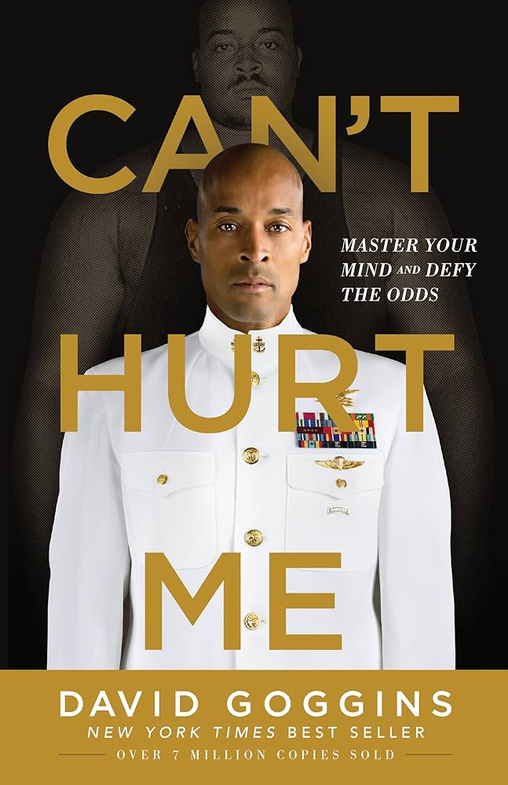
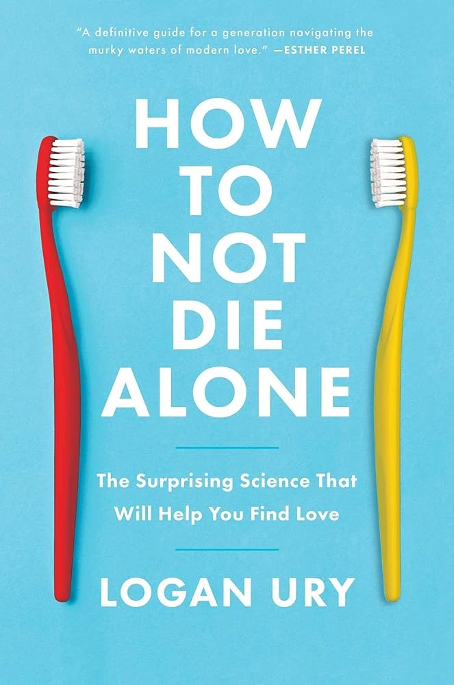
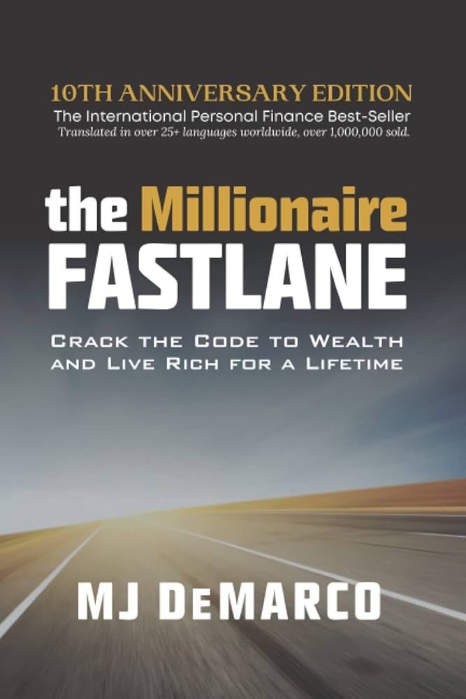
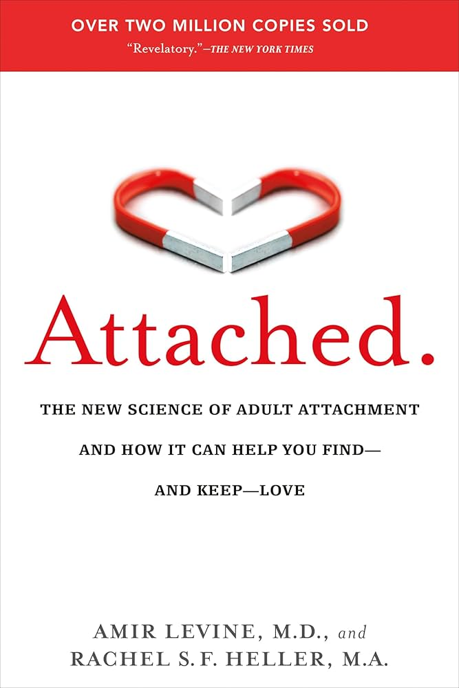

# Books I recommend

## Can't Hurt Me

{width=200, side-h2-image}

Can't Hurt Me by David Goggins is an absolute masterpiece in the realm of self-discipline and mindset.

No matter how hard you've had it and how hard your childhood was, there is very little chance that it can compare to Goggins' childhood. That dude spent his childhood with an abusive father, working his ass off in a skating rink when he was six years old, and witnessing his mother, brother and himself being beaten regularly.

Although he and his mother managed to escape his father when he was 8, they were still dirt poor and Goggins suffered from racism, being regularly called "nigger" and at one point having a gun held to his head for being black. More, because Goggins had such a fucked up childhood, he had trouble learning, leading to a vicious circle where he cheated on tests to get by because he was too much behind.

During his final year of high school, Goggins was tired of aimlessly drifting through life and found a purpose: he wanted to get into the Air Force. But he couldn't cheat on the entry test, and had to get real with himself: acknowledge that he was a complete loser, all the various ways he was failing, and all the shit he would have to do.

> “Look at you,” I said. “Why do you think the Air Force wants your punk ass? You stand for nothing. You are an embarrassment.”

> “You are one dumb motherfucker. You read like a third grader. You’re a fucking joke! You’ve never tried hard at anything in your life besides basketball, and you have goals? That’s fucking hilarious.”

He did manage to get into the Air Force. But he wasn't yet "hard of bone and mind". Being negatively buoyant, he struggled with water training, and wanted to quit. When a medical report came that he had the Sickle Cell trait, he took that opportunity to quit and pretended to be distraught, but inside he knew the truth: he was a quitter.

> These days, that kind of thing wouldn’t even register on my radar. **You tell me to run longer and harder than everyone else just to get a fair shake, I’d say, “Roger that,”** and keep moving, but back then I was still half-baked. Physically I was strong, but I was not even close to mastering my mind.

Numb and purposeless again, he had to work one of the shittiest jobs ever: exterminator at restaurants, cleaning up the rat traps. In addition to that, he had buried his shame in food and ballooned up to 300 pounds. 

This was when everything changed, and he saw this video on the TV:

<YoutubeVideo id="https://www.youtube.com/watch?v=PbVcIMXz6Go&t=551s"/>

The Navy SEALs. The world's toughest fighting force. Could a 300lbs loser who never accomplished anything in his life join them?

> I walked back to the bathroom, faced the mirror, and stared myself down. I looked every bit of 300 pounds. I was everything all the haters back home said I would be: uneducated, with no real world skills, zero discipline, and a dead-end future. Mediocrity would have been a major promotion.

I know full well what Goggins was feeling, although not to his level. I felt it when I started self-improvement. You can probably relate too. The stage in your life when you are so close to rock bottom, and you have such big goals, that you can't help but feel it's a fool's errand. That you should just give up and be a loser, be "realistic", stay in your lane.

Fortunately, Goggins did not give up, and so far, neither did I.

After three weeks of calling various recruiter offices, one finally gave him a chance. But Goggins had three months to not only lose 106 pounds, but study even harder to pass the entry test.

> Who the fuck did I think I was? I was born nothing, I’d proven nothing, and I still wasn’t worth a damn thing. David Goggins, a Navy SEAL? Yeah, right. What a pipe dream. I couldn’t even run down the block for five minutes.

Goggins had doubts. Despite meticulously planning my life path and earning victories, I still have doubts. Every single champion had doubts. This is a requirement for success.

But Goggins overcame those doubts, and after grinding every single day for three months, he was admitted to SEAL training. But of course, it wasn't over. Hell Week is 130 hours of what could only be described as pure torment, including endless pushups and situps, "surf torture" where you lay down in the sand and the cold water, and various exercises with boats and logs. Obviously, you are well-rested and get 4 hours of sleep. Not per day, in total.

During his first Hell Week, Goggins got forcefully pulled out after contracting double pneumonia and got rolled back to day one, week one. But this time, he truly wasn't in the mind for quitting.

> I was running with a log on my shoulders, vomiting blood. Bloody snot streamed from my nose and mouth, and the instructors periodically grabbed me and sat me down nearby because they thought I might drop fucking dead. But every time they turned around I was back in the mix. Back on that log.

> Kenny kept hearing the same refrain over the radio that night. “We need to get Goggins out of there,” one voice said.

> “Roger that, sir. Goggins is sitting down,” another voice crackled. Then after a beat, Kenny would hear that radio chirp again. “Oh shit, Goggins is back on the log. I repeat, Goggins is back on the log!”

Goggins went through training all over again, through his second Hell Week, but ultimately had to be pulled out again for a fractured knee. This time, he had to take some months off to recover.

At this point, he had to look back. He had overcome a lot. He had beaten Hell Week twice, demonstrated his strength of mind, and conquered his fear of water. What did he have left to prove? He could've stopped right there, and nobody would've faulted him for that. But Goggins was honest with himself.

> “I’m afraid. I’m afraid of going through all of that shit again. I’m afraid of day one, week one.”

This honesty kept him from giving up, and under the pressure of it being the last time he'd be allowed to go through training, as well as his wife being pregnant, he managed to finally become a Navy SEAL on his 3rd try.

But this wasn't enough for Goggins, oh no. After becoming a SEAL, he went on to run ultramarathons (100+ miles), beating the pullup world record after two failed attempts, and graduating Army Ranger School. Proving that you shouldn't rest on your accomplishments and that you are never finished.

I want you to reflect on that and transpose it to your own life. Would you be back for the 3rd round of Hell Week? Would you even have managed to lose 100 lbs and study your ass off to pass the entry test, despite a lifetime of trauma and doubts instilled in you from childhood? Would you be "back on the log" every time life tried to pull you out of the grind?

If not, then you absolutely need to callouse your own mind; and there's nothing wrong with that, because I needed to do it too. Western Society has become so easy that people are, more and more, brought up in environments that didn't challenge them at all, unprepared for the harsh reality and competition of life. And this is how you get to 25, 30, 40 years old being beaten in every single metric by teenagers.

This isn't meant to be a summary of the book, and I've left out a lot of important details. But I very heavily recommend reading and re-reading it. To this day I still re-read the first five chapters, to keep in mind the power of the human brain and what I am capable of, and what I ought to do to achieve my goals.

## How To Not Die Alone

{width=200, side-h2-image}

I believe that [the purpose of life is happiness](/purpose), and a 80-year study on happiness run by Harvard found that [the biggest correlation to happiness was relationships](https://www.youtube.com/watch?v=vSQjk9jKarg). It follows that relationships are extremely important, and romantic relationships even more so: the person you marry has the biggest impact on your life, which is obvious when you think about it.

I've read quite a few "relationship books" that were all redpill or redpill-adjacent: The Way of the Superior Man, How To Be a 3% Man, The Book of Pook, and Models. I rejected them all as I utterly disagree with the redpill ideology. I believe men and women can be equal, and I treat them equally. Any dating advice that treats men and women as different species and talks about "masculinity" and "femininity" is something that is completely useless for me, as I want an equal relationship.

Therefore, I was very delighted to read that book, written by Logan Ury, a professional dating coach who works as the Director of Relationship Science at Hinge. That book is endorsed by Esther Perel, herself being a world renowned relationship therapist and who the Hormozis look up to. In other words, that book has credentials and isn't just written by anybody.

I have [a very unorthodox view on relationships](/relationships) and it was very nice to see that this book pretty much confirms that view. That love should be done with logic, not with feelings; that you should bring the world of business into relationships by doing regular checkups and "contracts"; and that love doesn't "just happen" but is built purposefully.

Most importantly, compared to the redpill books I mentioned earlier, one can see the difference in quality of content. None of those relationship books talk about when and how to breakup vs get married, or how to have hard conversations, or what to look for in a partner. Instead, it's just a set of instructions on how to handle the masculine-feminine dynamic. This is fine if you want that, but that alone isn't enough to maintain a relationship.

How To Not Die Alone gives you the full set of knowledge: how to deal with your existing flaws (being too romantic, not looking for the right qualities, waiting too long, etc), how to actually meet people in 2025 (that book was written in 2021) in the age of dating apps, and most importantly, how to maintain a relationship after it's gotten serious (as well as how and when to define the relationship).

I honestly wish I'd read that book *before* getting into my relationships, as it would've prevented a lot of mistakes and made things easier overall.

I heavily, heavily recommend this book to literally anyone who isn't already in a healthy committed relationship. Even if you are already dating, the last section of this book could very well help you with your relationship problems and prevent you from making newbie mistakes. Most importantly, it will change your mindset regarding love, and cure you of both the Disney "it's just meant to happen" mindset as well as the modern redpill "treat your woman like a stupid slave" mindset that are infesting society.

I genuinely think that if everyone were to read that book, the world as a whole would get better, as relationships are an integral part of society, and they are currently falling apart.

## How To Win Friends And Influence People

{width=200, side-h2-image}

Although HTWFAIP is a well-known classic, there's a reason it's been a consistent classic ever since it's been published almost 90 years ago in 1937. Whereas How To Not Die Alone deals with romantic relationships, HTWFAIP deals with all other kinds of relationships; and, as I stated earlier, relationships are the highest precursor to happiness.

Despite the name, this book isn't really "how to make friends", where we would expect some generic answer like "get outside, talk more, etc". A correct answer, but about as effective as saying that the way to master boxing is to punch harder and faster.

The book itself is extremely well written. All chapters end with a memorable principle, all principles are regrouped in 4 different parts, and each chapter simply consists of introducing the principle through a dozen examples to really illustrate how to use it. I wish every book was written this way as it makes it extremely easy to remember the lessons.

HTWFAIP is more of a sales book than a social skills book, and the two intertwine in many ways. It teaches the fundamentals in interacting with people that, despite being desperately needed, nobody explicitly teaches.

Even if you're an extrovert and far from a loner, I still recommend reading it, as even if you understand most of the principles intuitively, it will help to see them written and make you evaluate whether you are using them effectively.

And, like any good book, you have to re-read it periodically (the book itself tells you to do this), as those principles are so alien and counter-intuitive to what we usually do that we have to periodically refresh our mind to not fall back into old habits. Study that book like it's for a college final exam, until you deeply understand it and are applying all principles in your life.

Last, I'd like to repeat the book's emphasis that this isn't a "bag of tricks". You shouldn't become a psychopath. Instead, simply view this as the way to achieve what we innately crave most: deep relationships with other people.

So far, applying those principles helped me, and it will probably help you too, just like it helped millions of other readers.

## The Millionaire Fastlane

{width=200, side-h2-image}

A very good book to change your mindset on wealth, and how the "save yourself rich" mindset doesn't even work in the end because inflation makes your money worthless.

The book distinguishes between the "sidewalk" (mismanaging your money), the "slow lane" (saving every penny to get rich) and the "fast lane" (what you actually want).

It further emphasizes that you can't just run any business to get rich; businesses have to follow certain principles. Many people start a bakery or a coffee shop, then end up shackled by their business. But you can't become a millionaire with a bakery; you can, however, become a millionaire with an agency or a SaaS. MJ DeMarco practices what he preaches, as he got rich from selling his software.

Not much re-read value compared to the previous books mentioned, but still a very good read if you haven't got the right mindset about money yet.

## Attached

{width=200, side-h2-image}

The concept of attachment styles was discovered decades ago during studies about how children relate to their parents, but it was only relatively recently that it was discovered that it also applies to romantic relationships. In fact, studies suggest that the way we relate to our parents will have a lot of impact on the way we relate to our partner.

Therefore, this book is to me a must-read regarding relationships; either to find out your own attachment style and how to prevent it, or to know when you're dating someone with an anxious or avoidant attachment style and how to deal with it.

Because few people have a secure attachment style, this book will very likely give you valuable insights regarding the psychology of relationships.
