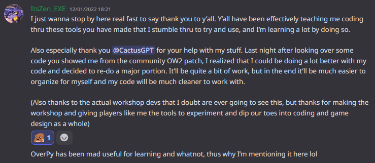
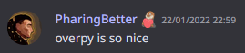

# The birth of a programming language: <br>Making the Overwatch Workshop usable


## The Overwatch Workshop

On April 24, 2019, Blizzard introduced the Overwatch Workshop: a scripting platform allowing players to create their own gamemodes in Overwatch (a TF2-like game).

Unlike traditional programming languages, it is an event-driven system where there is no clear “linear” execution path of the code. This is necessary to accommodate the nature of the game: the Workshop is not a general programming language like C or Java, but a domain-specific language made solely for Overwatch custom games.

Workshop scripts are made of rules, where each rule has one or multiple conditions. When all conditions are true, the actions (instructions) run.

In the following example, there are two rules:
1. If the player is on ground, start burning;
2. If the player is not on ground, stop burning.


{fullwidth}

Note that we could swap the order of the rules without affecting the code. A rule triggers when a condition goes from false to true, or when it is initially true at the start of the game.

This event-driven paradigm takes a while to get used to, but it is ultimately the best option for the Workshop and easily adapts to how the game works in practice.

However, when the Workshop was released, it had several limitations:

- **No variable names, and only 26 variables (A to Z).** This forced the use of a reference sheet for big programs to keep track of what `K` is used for, as well as directly coding constants in the program rather than put them in a variable. This is a bad programming practice, as if you have to update a constant, you have to update it in every spot it is used.

- **No comments.** As you can see in the screenshot, you can put names in rules, but that’s about it. If a rule has 100 actions (common in complex gamemodes), good luck remembering what each action is used for.

- **No user-defined functions.** If you had to repeat a piece of code multiple times, you had no choice but to copy-paste it. Meaning, if you had to modify it, you had to make sure to also modify every other instance.

- **The syntax was horrific.** For example, `A = B*C+D`{scala} became `Set Global Variable(A, Add(Multiply(Global Variable(B), Global Variable(C)), Global Variable(D)))`{scala}. Complex operations were near-unreadable.

{width=300px}

- **Most importantly, it was a graphical interface rather than text.** This was a necessary design decision as it needed to be usable on console. However, this led to an inability to use text editors for basic code management (multiple files, version control, copy-paste, find & replace, etc).


After coding my [Zombie Escape](https://workshop.codes/3AZ61) recreation and dealing with the limitations of the Workshop, I decided to create a high-level language to make it more convenient to build large gamemodes and fix most of the shortcomings.

## Assembly -> C -> Java

To understand why I would make a programming language from scratch, we first need to look at the purpose of programming languages in general.

Your processor (CPU) can only execute instructions in assembly, which look like this:

```asm
format_str db "Sum = %d",10,0   ; Format string for printf

main:
    push rbp
    mov rbp, rsp
    mov edi, format_str  ; First argument to printf
    mov esi, 5           ; Load a = 5
    add esi, 3           ; Add b = 3 to esi (sum = a + b)
    xor eax, eax         ; Set eax to 0 (prepare for printf)
    call printf          ; Call printf(fmt, sum)
    xor eax, eax         ; Set eax to 0 (return value)
    pop rbp
    ret
```

What does “push rbp” mean ? Fuck if I know, I just asked gpt to generate an example of assembly code. This is basically unreadable (even with comments).

Assembly is very primitive with simple instructions (add a variable to another, set a variable to a value, call a function, etc). This makes it very repetitive and error-prone, but also very flexible. The fact that instructions are simple makes it possible to optimize processors to be fast for everything.

Eventually, higher level languages were developed. This is what the above code looks like in the "C" language:

```c
int main() {
    int A = 5, B = 3;
    int sum = A + B;
    printf("Sum = %d\n", sum);
    return 0; //0 = program executed successfully
}
```

This is much more understandable and we can finally figure out what this program does: A is 5, B is 3, sum is A+B, it prints “Sum = ” followed by the sum.

Because processors can only run assembly, a program called the “compiler” translates C to assembly. The further a language is from assembly, the “higher” level it is. Hence, high-level languages are easier to work with than low-level languages, as they contain more abstraction layers to make it easier for the programmer.

The C language, although still quite primitive, already has a lot of advantages over assembly:

- **Variables can be named.** In assembly, there are only 16 general purpose "registers", which are the built-in variables of the processor. In the assembly example, the `esi` register is `A`, which then becomes the `sum` variable. Registers are reused, making it hard to keep track of which register is used for what over the course of a program.

- **Instructions can be more complex.** You can write `A = B+C*D` on one line, whereas it would require multiple instructions in assembly and would be harder to understand.

- **Automatic optimizations.** We would normally use the `mov eax, 0` instruction to set `eax` to zero, but `xor eax, eax` is more efficient and so compilers will automatically translate assignments to zero to a `xor` instruction.

- **Automatic handling of boring stuff.** The reason we set `eax` to zero before calling `printf` is because the calling convention specifies it. In C, the compiler handles that for us.


However, there is a disadvantage: you no longer control your entire code. With today’s super-fast processors, as well as modern compilers, this no longer matters. But back in the day, it was common to mix assembly and C, with critical performance-sensitive parts written in assembly to take advantage of tricks the compiler wouldn’t do (like the xor trick).

This leads to the following tradeoff:

- The higher-level a language is, the more ergonomic and faster it is to program in it.
- However, the additional abstraction can make the program less performant.

The vast majority of programs did not require *that* much speed, and another programming language was eventually developed: Java.

Java introduced even more abstractions to simplify the programmer’s life, such as:

- **Memory management.** In C, you need to manually manage the memory (RAM) that your program will use. Java automatically requests and frees memory. This leads to more secure code, as programmers would often forget to free the memory, or not request enough memory.
- **Exceptions (errors).** When an error occurs, a “stack trace” is given with a precise location of the error and the path taken by the code. In C, you need to manually handle errors.
- **Safety checks while the program runs.** In C, there is no check that an array isn't accessed out of bounds, which is a security issue. In Java, the program automatically does boundary checks when accessing arrays.

This made it even easier to write big programs, but made it slower than C due to the additional abstractions and runtime checks.

Therefore, Java was used for programs such as enterprise management systems, where performance wasn’t so much of an issue. However, C was used for operating systems (Windows, Linux) and video games, where speed is crucial.

The same tradeoff of ergonomy vs performance applies in the Workshop.

## Workshop -> OverPy -> OSTW

The Workshop language is the equivalent of assembly: you can only program an Overwatch custom game in the Workshop language.

The Workshop has a lot of limitations, including processing power; it feels like you are on a 1950's computer. Simple loops and calculations can make it lag too much and lead to a server crash.

I therefore decided to limit the layers of abstraction and build the equivalent of C: a light layer of abstraction over assembly. I decided to use a Python-like syntax, and because my creativity is limited to Minecraft server names, I called it OverPy.

The philosophy of OverPy is that you should be able to do the compilation “in your head”, as the Workshop is so complex and tricky that you need to know exactly what the compiler is doing and what Workshop code it will generate.

Another programmer, Deltin, had the same idea but a different execution.

Deltin decided to build OSTW, the equivalent of Java: making the language as ergonomic as possible, at the cost of performance and less control over the abstractions. Because of that, he could add features such as classes and functions.

Note that there is no “best” language here. It is a tradeoff: you can use OSTW for easier management of big projects, or OverPy if you want more control over the abstraction and performance.

In practice, the community used both in an approximate 50/50 split, with some moving from OverPy to OSTW to take advantage of the additional features, and some coming from OSTW to OverPy to get closer to the Workshop language. The Workshop itself also evolved and improved upon its original interface, meaning high-level languages are now less needed (although still very useful).

## How a compiler works

Let's take some basic code as an example:

`eventPlayer.power = globalPower * 1.5 + 30`

### Step 1: The Tokenizer

The first thing to do is to transform this code into "tokens", basically the equivalent of words. Without this, it will be extremely hard to perform further operations on it.

A primitive tokenizer would simply output each token in an array:

`["eventPlayer", ".", "power", "=", "globalPower", "*", "1", ".", "5", "+", "30"]`

In practice, each token is an object, as it also needs to hold the information about where it is to display accurate error information.


The image below is the actual tokenizer, which has the `fileStack` attribute to keep track of where the token is (line and column number, but also file import history). The entire line is also an object, with an `indentLevel` attribute (since OverPy is an indentation-based language, it is needed to recognize blocks).


### Step 2: The Parser

Once we have this standardized representation, we need to turn it into a tree (called AST: Abstract Syntax Tree). This is the job of the "parser".

We first have to determine the order of operations, which is member access (.) -> multiplication (*) -> addition (+) -> assignment (=). If we add parentheses, the line looks like:

`(eventPlayer.power) = ((globalPower * (1.5)) + 30)`

By using simple recursion, we can turn that into a tree:
1. Find the operator with the *lowest* priority. Here, it is the `=` operator. This is where tokenizing becomes useful: it is very easy to distinguish the `=` operator from the `==` operator, or from a `=` character in a string/comment.
2. Find the pseudo-function for that operator. Here, it is `__assignTo__()`.
3. Split the tokens around that operator. We get `eventPlayer.power` and `globalPower*1.5+30`.
4. Repeat from step 1 with each side of the split (separately). For example, we will repeat the algorithm with `globalPower*1.5+30`, where the lowest priority operator is "+".
5. Add the results from each side of the split as arguments for the pseudo-function, and return the pseudo-function.

The final result is:

`__assignTo__(__playerVar__(eventPlayer, power), __add__(__multiply__(__globalVar__(globalPower), __number__(1.5)), __number__(30)))`

This is of course a textual representation. The actual representation is a tree of `Ast` objects, each having attributes: name, arguments (themselves `Ast`s), types, children (for blocks like `if`), the `fileStack` attribute we saw earlier, and various attributes for post-processing.


### Step 3: The AST

With the AST now built, we can simply iterate recursively on it and perform optimizations (bottom to top).

For example, this is an optimization for the `__add__` pseudo-function that transforms `A+0` into `A`:

```js
//If one of the arguments is 0, return the other argument.
if (content.args[0].name === "__number__" && content.args[0].args[0].numValue === 0) {
    return content.args[1];
}
if (content.args[1].name === "__number__" && content.args[1].args[0].numValue === 0) {
    return content.args[0];
}
```

We can also make another optimization transforming `A=A` into `pass` (useless instruction):

```js
if (areAstsEqual(content.args[0], content.args[1])) {
    return getAstForUselessInstruction();
}
```

These optimizations can be recursively combined: `A = A + 0` becomes `A = A` then `pass`.

Optimizations are extremely useful, especially when it comes to the Workshop. As it is very slow, every calculation matters: it therefore allows you to make your code clearer. You can define `globalPower` as `30` and it will turn `globalPower * 1.5 + 10` into `55`.

Most features of the compiler are also implemented on the AST, as it is the easiest form of the language to do transformations on.

### Decompiler

Just like OverPy has a compiler (turning OverPy code into Workshop code), there is a decompiler doing the opposite.

It works the exact same way as the compiler (Workshop text -> tokens -> AST -> OverPy text), as in the end it is the same task of transforming a language into another.

This was a very good feature as nobody wants to rewrite their existing gamemode in a new language, and was a crucial help in getting widespread adoption by the community.

## Mistakes I made

As OverPy was the first full-fledged programming language I made, I unfortunately made several mistakes in its conception.

### 1. Sticking too close to the source syntax

When creating a language, it is best to take the syntax from an existing popular one. This removes a huge burden from you as you can just copy what works. Most languages that tried to create a completely new syntax ended up being hard to read or write (e.g. AutoHotKey). I decided to go with Python, as I was working a lot with it at that time.

However, keep in mind that **the syntax does not define a language**. I could’ve created OverC and followed a C-like syntax, but all that would’ve changed is the addition of braces and semicolons, rather than an indent-based hierarchy.

Python has its own philosophies, and OverPy is not a general programming language; it has to adapt and create its own philosophies when it comes to the Workshop. The mistake I made was staying too close to Python.

OverPy v1 had the following syntax to declare a rule:

```
@Rule "player finished entering base"
@Event eachPlayer
if eventPlayer.playerObjectInBase != null and eventPlayer.baseProtectionTimer == 0 and eventPlayer.isAlive() and not gameEnded:
    eventPlayer.setDamageDealt(0)
    eventPlayer.setInvisibility(Invis.ALL)
```

This was quite clunky and tried to force the rule-based Workshop script to a general scripting language. The top-level `if` was translated to a rule condition, while other `if` statements were translated to actions. Those behave very differently, and OverPy needed to reflect that.

In v5, I decided to fully embrace OverPy as a domain-specific language, and follow in the spirit of Python by introducing syntax changes that break all existing code.

```
rule "player finished entering base":
    @Event eachPlayer
    @Condition eventPlayer.playerObjectInBase != null
    @Condition eventPlayer.baseProtectionTimer == 0
    @Condition eventPlayer.isAlive()
    @Condition not gameEnded

    eventPlayer.setDamageDealt(0)
    eventPlayer.setInvisibility(Invis.ALL)
```

This is much more readable as each rule is now its own block (meaning you can easily collapse and visually distinguish them), and all rule metadata is prefixed by `@`. Python has no `rule` keyword, but it doesn't matter: OverPy is made for the workshop, and only has to follow Python as a starting point.

I also fixed what I consider to be Python’s shortcomings:
- Replacing True/False/None by true/false/null for consistency with other languages.
- Adding multiline comments with /* */.
- The tabs vs spaces debate is solved by considering tabs as being 4 spaces. In the six years since OverPy was made, I have never seen a complaint about that (who uses anything other than 4 spaces anyway?)
- The ++ and -- operators were added, because why not?
- The naming conventions are closer to Java: ALL_CAPS for constants, PascalCase for enums and modules, and camelCase otherwise. This was to more easily allow users to distinguish between different types, and also because I dislike snake_case.

### 2. Adding unnecessary abstractions

There were some cases where I made confusing changes to the Workshop syntax:

- `Workshop Setting Real(...)` became `createWorkshopSetting(float[min:max], ...)`. I wanted to coalesce all `Workshop Setting` functions into one single `createWorkshopSetting` function taking a type as the first argument. But the type syntax isn’t used anywhere else in OverPy and it was useless, so I changed it to just `createWorkshopSettingFloat()`.
- The `Last Of(array)` function became `array[-1]`, like in Python. But it was very misleading: it implied you could use negative indexes (and so do `A[B]`  where B is -1, or do `A[-2]`, etc). If you tried that, it failed silently and returned null, as there are no exceptions in the Workshop. I eventually changed it to `.last()`.

The mistake was approaching it as if the user was already familiar with other programming languages but not the Workshop (as was the case for me). But the vast majority of users were familiar with the Workshop, but not programming languages. Deviating from the Workshop syntax had to only be done when truly necessary (such as operators, which match Python syntax).

### 3. Not using a typed language to write the compiler

I did not program OverPy in Python (as the language the compiler is programmed in is unrelated to the syntax), but rather in JavaScript: the goal was to run it on the web so that other people could use the OverPy compiler in their projects.

This was a very good decision and made it possible to power third-party projects such as the [MIDI Converter](https://github.com/ScroogeD2/owmidiconverter) or the [Workshop UI recreation](https://workshop.codes/workshop-ui?uuid=4d77021d-fb54-40b8-87a7-502551d10b6e).

However, the complexity of the code eventually became too much to handle without any type hints, and I regretted not using TypeScript from the start. Thankfully, CactusPuppy spent quite some time converting the codebase to TS, making it much easier to work with as basic errors are immediately caught by the type checker.

Although I find TypeScript to be overkill for websites, I definitely recommend it for full-fledged programs.

### 4. Doing C-like preprocessing

Just like C, I made a “preprocessing” step involving macros. For example:

```
#!define kbMult 1.3
#!define kbScalar 0.2
#!define kbMultScalar (kbMult*(1-kbScalar))
#!define kbRatioMult (kbMult*kbScalar)

rule "apply knockback on damage":
    @Event playerDealtDamage
    kbStrength = eventDamage*(kbMultScalar+kbRatioMult*getNumberOfPlayers())
    #equivalent to:
    kbStrength = eventDamage*((1.3*(1-0.2))+(1.3*0.2)*getNumberOfPlayers())
```

This is consistent with doing the compilation “in your head”: because the user creates the macros, there is no question that they are replaced at compile time rather than at runtime.

The big mistake, however, was following in C’s mistake and doing verbatim macro replacements. This leads to problems like these:

```
#!define add(a,b) a+b
result = add(a,b)*3 #will actually yield a+b*3 which is a+(b*3), not (a+b)*3
```

This requires wrapping all macro definitions as well as all parameters with parentheses, and unfortunately I never got around to fixing that.

What I should’ve done is use AST-based macros: replacing the AST directly rather than the text. There was pretty much no use at all for text-based macros anyway.

## The features

To not let this post get too long, I only included the features that were interesting from a technical point of view.

### Switches

Let's take the following code as an example:

```
if eventPlayer.team == Team.ZOMBIES:
    damage(eventPlayer, null, 100)
elif eventPlayer.team == Team.HUMANS or eventPlayer.team == Team.HEALERS:
    heal(eventPlayer, null, 200)
else:
    bigMessage(eventPlayer, "You need to choose a team!")
```

The above code is an if/elif/else chain which compares `eventPlayer.team` to a value. However, since it duplicates `eventPlayer.team`, it is not perfectly optimized (imagine it was a very complex calculation instead).

We can solve that using a `switch` statement:

```
switch eventPlayer.team:
    case Team.ZOMBIES:
        damage(eventPlayer, null, 100)
        break
    case Team.HUMANS:
    case Team.HEALERS:
        heal(eventPlayer, null, 200)
        break
    default:
        bigMessage(eventPlayer, "You need to choose a team!")
```

This is functionally the same as the if/elif/else chain, but only calculates `eventPlayer.team` once. But the Workshop has no `switch` statement; as such, I had to implement it manually.

The way a switch is implemented is through a “jump table”: simply a dictionary with the offsets of each `case` statement. Without the `switch` instruction, this is how you would do the above code in an efficient manner:

```
goto loc+{
    Team.ZOMBIES: 0,
    Team.HUMANS: 2,
    Team.NOTEAM: 2,
    default: 4,
}[eventPlayer.team]
damage(eventPlayer, null, 100)
goto switch_end
heal(eventPlayer, null, 200)
goto switch_end
bigMessage(eventPlayer, "You need to choose a team!")
switch_end: #This is a label
```

This is what the compiler transforms the `switch` statement to internally. The `goto loc+` instruction allows jumping a specific amount of instructions.

But the Workshop has no dictionaries either. So how could we simulate one?

The most straightforward solution is simply to use two arrays: one array holding all the keys, another array holding all the values. Then, a dictionary access simply finds out the n-th key that is equal to the key we want to access, then accesses the n-th value. The above dictionary is compiled to:

`[4, 0, 2, 2][[Team.ZOMBIES, Team.HUMANS, Team.HEALERS].index(eventPlayer.team)+1]`

We add 1 to the index to take advantage of the fact that `.index()` will return -1 if the key is not found. That way, the default key is at index 0.

Lastly, we can exploit a feature of the Workshop to make it even more optimized. Normally, only one `else` statement is allowed in an if/elif/else chain, but the Workshop allows multiple `else` statements. Therefore, if the script takes the `if` branch then encounters an `else`, it goes to the end of the chain, effectively acting like a `goto` (it was quite fun modifying the OverPy compiler to handle that...)

This is the final transformation of the code above:

```
if true:
    goto loc+[4, 0, 2, 2][[Team.ZOMBIES, Team.HUMANS, Team.HEALERS].index(eventPlayer.team) + 1]
    damage(eventPlayer, null, 100)
else:
    heal(eventPlayer, null, 200)
else:
    bigMessage(eventPlayer, "You need to choose a team!")
```

### Lowercase text

To conform with Overwatch's style, all text is uppercased. This is quite ugly, especially with big paragraphs of text (such as a tutorial). This is done within the renderer and is impossible to bypass.

Ｆｕｌｌｗｉｄｔｈ ｌｅｔｔｅｒｓ, however, were not uppercased; but they certainly weren't pretty to look at due to the extra spacing.

The solution? Simply overlay multiple texts, using specific Unicode spaces to get perfect kerning (the font Overwatch uses contains a 1-unit wide space, which is perfect for this).


Implementing the algorithm took several days (as it turns out my terminal kept messing up the spaces from my testing script, which made it very fun to debug), and I had to carefully handle color and texture tags which had to not be included in the width calculations, but the result is pixel-perfect lowercase text.

As such, `"This is lowercase text."` gets compiled to the three strings:
```
"  T        ｓ I    ｅ     ａ       ｔ ｔ   ­"
"  ฀ ｈ   ฀і  ฀ｏ     ｒ ฀ｓ   ｅ   .  ­"
"   ฀ і          ｓ  ｗ   ｃ  ฀ｅ  ｘ    ­"
```

### Bug fixing
Another one of OverPy’s jobs is to fix Workshop bugs whenever possible. For example, the `continue` statement behaves abnormally inside `if` blocks: OverPy thus compiles `continue` not as the Workshop's own `continue` statement, but as a `goto`.

I also displayed warnings when using code that could break. The Workshop's own documentation states that `wait(9999)` is to be used for an infinite wait; however, 9999 seconds is 2h46mn, whereas custom games can last up to 4h30mn. (Good luck debugging that.)


### JavaScript macros
There were times when OverPy wasn't powerful enough and I found myself generating OverPy code with external scripts. (You should always use your own products.)

I thought of expanding the preprocessor to be more powerful, but then I thought: I'm already creating a language, do I really need to create another one?

The easiest way is to include code generation as a first-party tool, and the solution is simple: JS macros.

```
#!define generateAlphabetMappings(mappings) __script__("generateAlphabetMappings.js")
```

The content of `generateAlphabetMappings.js` is JavaScript code which returns a string of OverPy code:

```js
`globalvar alphabet = [${Object.keys(mappings).map(x => "'"+x+"'").join(", ")}]
globalvar alphabetMappings = [${Object.values(mappings).map(mapping => "["+mapping.map(x => "'"+x+"'").join(", ")+"]")}]`
```

Then you simply call the function like any other function:

```
generateAlphabetMappings({
    "A": ["A", "a"],
    "B": ["B", "b"],
    "C": ["C", "c"],
    ...
})
#this yields:
globalvar alphabet = ["A", "B", "C", ...]
globalvar alphabetMappings = [["A", "a"], ["B", "b"], ["C", "c"], ...]
```

You would otherwise have to maintain two separate arrays `alphabet` and `alphabetMappings` and keep them synchronized. Here, those two arrays are automatically generated (they have to be separate arrays for performance reasons).

Including a JS scripting engine wasn't without its difficulties, however.

I initially used `eval()` until I realized you could just do `require("child_process").exec("calc")` to spawn the good ol' calculator. In practice, this means compiling someone else's OverPy project could install a virus.

I then used https://github.com/patriksimek/vm2 to sandbox the code, but there were vulnerabilities after vulnerabilities of gigabrain code to escape the sandbox (such as https://gist.github.com/leesh3288/e4aa7b90417b0b0ac7bcd5b09ac7d3bd).

This was fixed once and for all by using https://github.com/NeilFraser/JS-Interpreter which doesn't use the NodeJS engine and as such cannot be used to execute code on the host machine. This makes it slower, but it doesn't matter as JS macros are small pieces of code.

This was a very good feature and was used in some complex gamemodes such as [Conquest](https://workshop.codes/conquest) to generate code that had to be duplicated, or more generally to write data as JSON and automatically preprocess and separate it into different variables.

### Obfuscation

By design, the Workshop has absolutely no code protection. When you host a lobby, the code is public; with a few clicks, anybody can copy the code and edit it.

This is great for learning, which was part of what the Workshop was spiritually made for. However, it came as a big drawback: creators would spend weeks on their gamemodes and see them completely trashed.

This happened to me with my Zombie Escape gamemode. After a few weeks of carefully balancing each hero, I found my gamemode being hosted with all heroes enabled and everything turned up to 500%, completely missing the point of the gamemode (melee-heavy heroes were enabled in a gamemode where the goal is to use guns to push zombies away from you and not get infected by getting too close).

This led to a lack of integrity: it is obviously not nice for the creator to see other people messing with their gamemode without respecting the work gone into it, but most importantly, a user cannot be sure if the gamemode was the original or modified by someone else.

Some users hosted games with "host cheats" included, giving the host of the game an advantage. If you joined one such game, it was impossible to know.

Some unscrupulous users also straight up stole the credits, claiming the gamemode as their own.

The obfuscation feature in OverPy led to a lot of debate in the community, as it was compared to the greater open-source vs closed-source debate. However, there are important differences to take into account:

- There is no indication of whether you are using a fork or the original gamemode. In the open-source community, if something is forked, branding is usually redone to distinguish it from the original project.
- Projects only grow if they are useful. Meanwhile, in Overwatch, gamemodes tend to converge to low quality as random people each add their own touch to it, ending up with the equivalent of slop.

In the end, I decided to go with implementing this feature, which was extremely robust.

The obfuscation rests on two key features:
1. **The code cannot be opened within the workshop.** This is made by putting 2500 empty rules: when opening the code, the UI lags so much that the player is timed out and temporarily disconnected.
1. **The code cannot be copied and pasted outside of the workshop.** This was made by a simple discovery: when copying, numbers are truncated to 3 decimals. As such, `if 0.00001` would become `if 0`, making it possible to detect if the mode has been copied (and if so, display a message then make the game unplayable).

It is important that the code be as obfuscated as possible however, otherwise you could figure out how it worked and remove the copy protection checks. Therefore, I added additional obfuscation methods:

1. The low-hanging fruit: all variables are renamed to a combination of capital i and lowercase L, and rule names as well as comments are removed.
2. While playing around with the [Big List of Naughty Strings](https://github.com/minimaxir/big-list-of-naughty-strings/blob/master/blns.txt), I discovered that the Unicode tag characters would display as normal letters in Overwatch, but as zero-width spaces anywhere else. The solution is simple: replace all characters with Unicode tags, making all strings look like they are empty. (Interestingly, those characters eventually found another use as an [LLM hidden prompt exploit](https://x.com/rez0__/status/1745545813512663203))
3. All constants (heroes, maps, colors, etc), even if unused, are placed into a giant array, and references to these constants are replaced by the appropriate array index.
4. But the most important thing: the array index itself can be used with the decimal truncation bug! So `Color.BLUE` is translated to `constants[0.0000143*10000000]` to give `constants[143]`; upon copy-paste, all constants become `constants[0*10000000]`, completely breaking the gamemode in various ways.

This made for a perfect obfuscation. The code could not be viewed in the workshop, and trying to copy it to text would break it in various ways which would be near-impossible to understand. The only way to get the actual source code would've been to reverse engineer Overwatch itself.


Eventually, pages were added in the Workshop UI; only 100 rules are now displayed at a time. This made the obfuscation useless, as anybody could go in and add a "host cheat" rule, and there was no way of preventing that (and obfuscation was more about preserving integrity rather than preserving credit). Combined with the fact that it was very time-expensive to maintain, the feature was removed from OverPy altogether.

### Compression

The Workshop has a size limit for gamemodes, which isn't calculated in KB but "elements": one element is basically one function/value.

As such, `vect(10, 2, 34)` takes up 7 elements (one for `vect()` and two for each number, as `10` is actually `number(10)`). In large gamemodes, this adds up fast if you have a big array of vectors for every map.

This leads to a very unique method of compression: string compression.

A string only takes up 5 elements, and can contain up to 128 characters before having to be split into multiple strings.

For this example, we will use numbers, but vectors work the same way. A very basic implementation of string compression would be:

```
[int(n) for n in "12.34|5.1|53.65|43.67|106.3".split("|")]
```

We concatenate all numbers in a CSV-like format with `|` as a separator, then we split the string on that separator to get each number.

However, there is actually no `int()` function (that would be too easy…), and so we have to do additional tricks in order to convert strings to numbers.

The first thing to do is to define the "alphabet". As we are using strings to compress, each character will have a value. The easiest way is to use base 10, with each character representing its number. Our alphabet will therefore be `"0123456789"` (but could also be `"ABCDEFGHIJ"` or any 10 distinct characters).

Next, we need to make all numbers the same length by adding leading/trailing zeros. Since the decimal point is always at the same position, we can remove it:

`"01234|00500|05365|04300|10630"`

In practice, most numbers in an array have the same amount of significant digits after the decimal point, but not before. Therefore, by reversing the number, we can remove the leading zeros:

`"4321|005|5635|0034|03601"`

Then, to convert a string to its number equivalent, we simply map each character to its number ("0" to 0, etc) and multiply it according to the position (first character by 0.01, second by 0.1, etc). Remember that the digits are stored in reverse order.

```
[0.01 * "0123456789".strIndex(n.charAt(0))
+ 0.1 * "0123456789".strIndex(n.charAt(1))
+ 1 * "0123456789".strIndex(n.charAt(2))
+ 10 * "0123456789".strIndex(n.charAt(3))
+ 100 * "0123456789".strIndex(n.charAt(4))
for n in "4321|005|5635|0034|03601".split("|")]
```

The neat trick here is that `.charAt()` returns `""` if out of bounds, which then yields `0` from `.strIndex()` (as the empty string can be found at the very start), hence why we are able to remove leading zeros from a number.

However, we are repeating the alphabet string multiple times here. Our last trick is to map each number into a `[number, alphabet]` array before parsing the number:

```
[
    #i[0] is the number, i.last() is the alphabet
    0.01 * i.last().strIndex(i[0].charAt(0))
    + 0.1 * i.last().strIndex(i[0].charAt(1))
    + 1 * i.last().strIndex(i[0].charAt(2))
    + 10 * i.last().strIndex(i[0].charAt(3))
    + 100 * i.last().strIndex(i[0].charAt(4))
    for i in [
        [n, "0123456789"] for n in "4321|005|5635|0034|03601".split("|")
    ]
]
```

The final production code has a few additional changes:
- Uses a base 100 alphabet (to pack 2 digits per character);
- Only uses special characters and symbols (using letters or digits could create a censored word and silently corrupt the data as it would be replaced with stars);
- Uses `0` as separator instead of `|` so that we can do `.split(null[0])` which is converted to `.split("0")` and saves a few elements compared to specifying `"|"`.

```
[0.01 * i.last().strIndex(i[0].charAt(0)) + i.last().strIndex(i[0].charAt(1)) + 100 * i.last().strIndex(i[0].charAt(2)) for i in [[i, "\u0001\u0002\u0003\u0004\u0005\u0006\u0007\u0008\u0009\n\u000b\u000c\r\u000e\u000f\u0010\u0011\u0012\u0013\u0014\u0015\u0016\u0017\u0018\u0019\u001a\u001b\u001c\u001d\u001e\u001f !\"#$%&'()*+,-./2:;<=>?@Q[\\]^_`q|}~\u007f\u0080\u0081\u0082\u0083\u0084\u0085\u0086\u0087\u0088\u0089\u008a\u008b\u008c\u008d\u008e\u008f\u0090\u0091\u0092\u0093\u0094\u0095\u0096\u0097\u0098\u0099\u009a\u009b\u009c\u009d\u009e\u009f¡"] for i in "#\r0\u000b\u00060~?0\u0080,0\u001f\u0007\u0002".split(null[0])]]
```

### Translations

Through very convoluted means, it is actually possible to get a player's language, and thus to translate gamemodes.

There is no native `getPlayerLanguage()` function, but casting a constant to string uses the player's language: `"{}".format(Color.WHITE)` will be `"White"` if on English, `"Blanc"` if on French, etc.

The easiest way to translate a string is thus:

```
["A string", "Une chaîne"][max(0, ["White", "Blanc"].index("{}".format(Color.WHITE)))]
```

We simply define the expected translations (here, just English and French) to get the language index (0 = English, 1 = French). If the player is not using either of those languages, the index will be -1, so we use `max(0, index)` to define English as the default language.

The problem is that the cast to string has to be done client-side. This is the case in HUDs, but not in variables. Therefore, this will not work:

```
eventPlayer.language = ["White", "Blanc"].index("{}".format(Color.WHITE))
```

This code is evaluated server-side, and the language will be the same for everyone, defeating the whole point of translations. This forces the whole language calculation to be repeated at every string. But is there really no way to get the language from a client and store it in a variable?

It turns out, there is. The `Player.startFacing()` function defines a facing direction, which can be reevaluated; this reevaluation has to be done client-side to not lag (e.g. if facing towards an enemy). Since it is done client-side, we can simply set the player to face 0° to the left if using English, 20° if using French, and 0° otherwise.

Then, we simply use the `Player.getHorizontalFacingAngle()` function to get the facing angle, which we divide by 20 to get the language index.

All this process is complicated, which is where OverPy shines. Translated strings are prefixed with the `t` string modifier, or the `_` function if context is needed. OverPy automatically translates the strings using the formulas specified above, and .po files are parsed and generated automatically at each compilation.

```
#!translations en fr es zh
rule "Welcome HUD":
    hudHeader(getPlayers(), t"Welcome to my awesome gamemode!")
    hudHeader(
        getPlayers(),
        _("translate the $", "You have ${}").format(localPlayer.money)
    )

    createdBy = t"Created by Zezombye"
    # Since createdBy is a translated string,
    # we need to use the _() macro to get the translated version.
    hudHeader(getPlayers(), _(createdBy))
```

This makes it so that, to translate a gamemode, a user simply has to specify the languages with `#!translations`, prefix all strings with `t` (unless stored in a variable, in which case the variable must be wrapped in the `_` function when displayed), and then fill out the .po files.

## Everything's a language
You might think "wow, Zez, you're the absolute best, I program in my spare time but I could never develop something as complex as a programming language!"

What if I told you that any programmer has created dozens, hundreds, if not thousands of languages in their career?

A language is a set of tools allowing you to *express* something.

A checkbox is a language. A quite shitty language: you can only express "yes" or "no". Yet it is still a language.

A form is a language. You can express more things: your date of birth, your mother's maiden name, and the 3 digits on the back. There are also restrictions: your date of birth must place you at an age above 18.

JSON is a language, which is deliberately limited. You can only express objects, arrays, booleans, strings, and numbers.

And you can build your own languages on top of JSON, and very likely did so:

```json
[{
    "title": "Back In Black",
    "channelName": "AC/DC - Topic",
    "channelId": "UCVm4YdI3hobkwsHTTOMVJKg",
    "id": "9vWNauaZAgg",
    "publishedAt": "2024-11-13T08:11:24Z",
}]
```

The above is a language that can express an array of songs, each song having a title, channel name, channel id, youtube video id, and publication date.

You likely saw some YAML configuration languages which allow expressing more complex structures, including conditions, loops, events, etc.

The lessons in this?
- Every time you parse a JSON structure or a form, then convert it to another format, you are creating a compiler. OverPy isn't much more complex than that; you already know the principle. I wrote the first version of the compiler in two days.
- You will invent plenty of languages in your career, and so it is best to not reinvent the wheel.
- Don't create a custom variant of CSV that can't handle arbitrary data (such as the delimiter itself, or a newline).
- If your JSON/YAML file can take conditions, it is likely a sign to migrate it to an actual scripting language.
- Don't create configuration languages from scratch. Use JSON, YAML or TOML.
- And if you create a programming language from scratch - please learn from the mistakes of earlier languages and use an actually good syntax. :\)

## Conclusion

This post was already very long, so I skipped over some features and difficulties (optimizing for size vs speed, including multiple files, dealing with operator precedence…)

OverPy was one of the biggest projects I've ever undertaken in my programming career, and I am very glad I did it.

It turns out, when you create a full-on programming language, including a parser, compiler, and optimizer, you get a much better feeling on how actual, mainstream programming languages work.

Most importantly, it made me discover the wonderful Workshop community; although Blizzard itself put it into maintenance mode (every update seems to add new bugs), Overwatch and its Workshop have been an integral part of my life and I will never forget the workshop.codes discord and its community.

The fuzzy feeling you get when your creation is downloaded 3,279 times and starred 186 times (at the time of writing) also cannot be understated, as well as the random gratitude I get for it.








Big thanks to everyone who contributed over the years, especially [CactusPuppy](https://github.com/CactusPuppy) and [Netux](https://netux.site/) who helped me maintain OverPy.

If you're interested, you can check out the code at https://github.com/Zezombye/overpy.

I hope you learned something, and feel free to share your thoughts :\)
