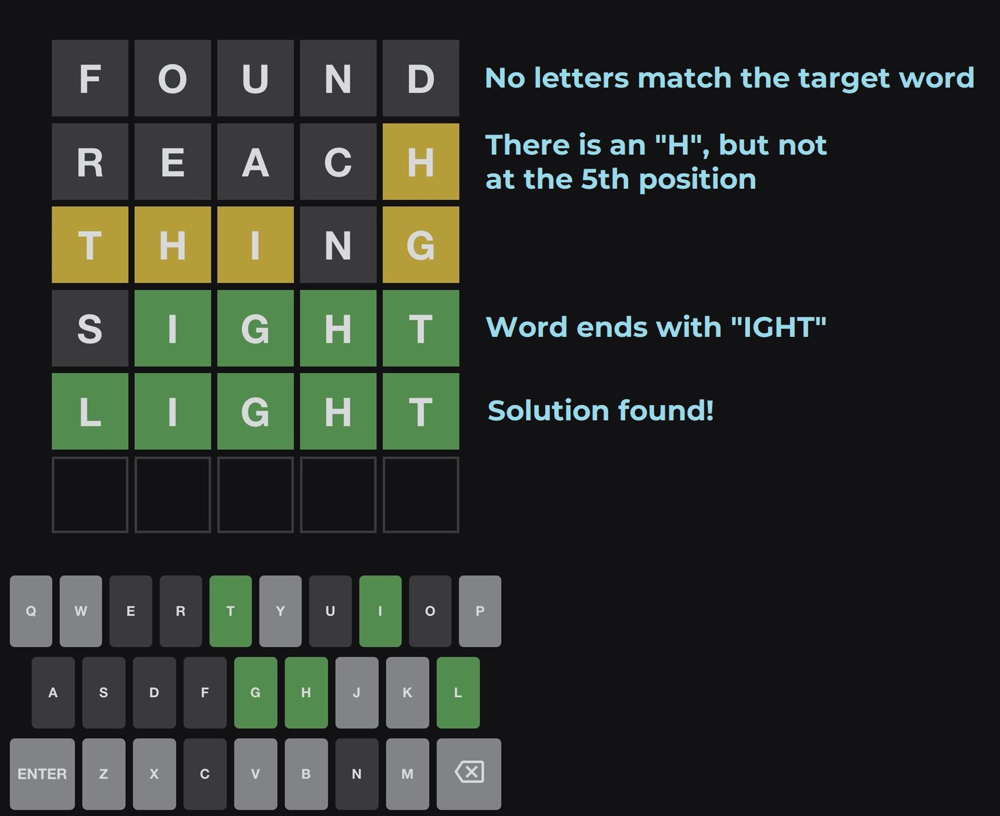
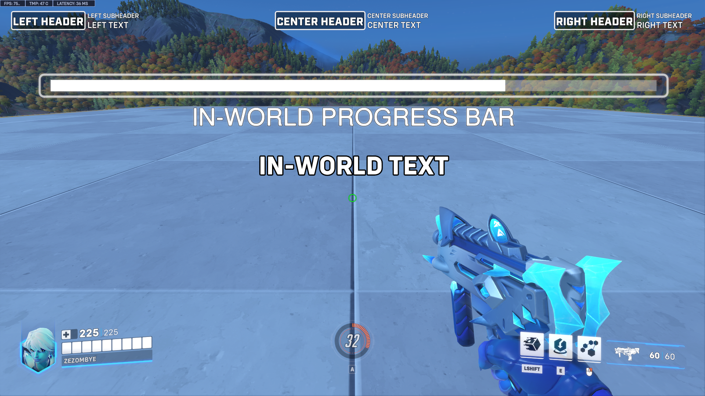
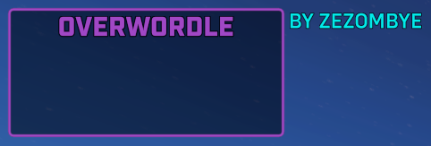
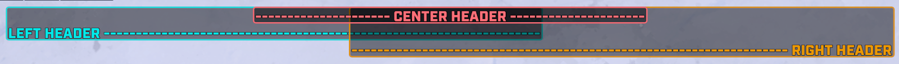
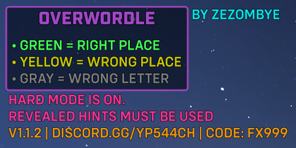
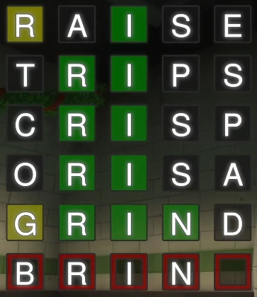
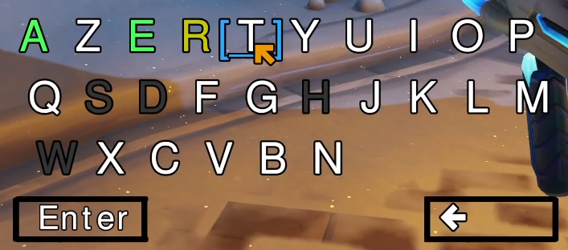
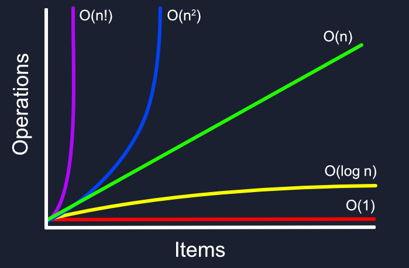
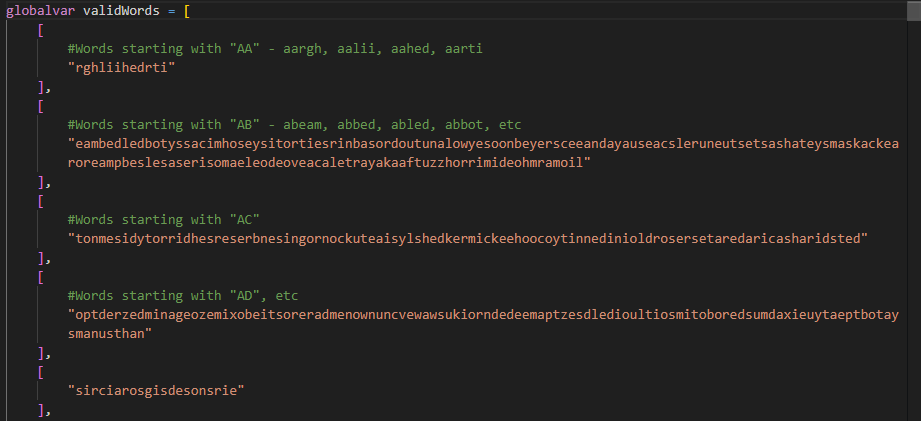
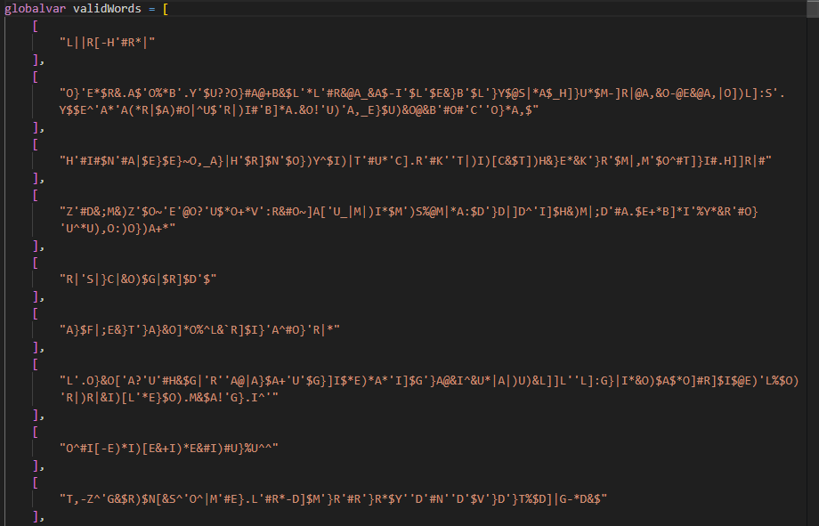

# Making a multiplayer Wordle: Pushing the Overwatch Workshop to its limits


## How Wordle works

In December 2021, the game of [Wordle](https://www.nytimes.com/games/wordle/index.html) became popular, in which you must find a 5-letter English word within 6 attempts.

The player is given colored clues:
- Green means the letter is in the target word, at the right position;
- Yellow means the letter is in the target word, at the wrong position;
- Gray means the letter is not in the target word.

For example, here is a typical game where the word was found in 5 attempts:



Within a few weeks, the game had 300,000 players, and it took over Twitter as well as every Discord server. The popularity was such that it was sold to the New York Times for over $1 million.

As I was programming in the Overwatch Workshop at the time, the next move was obvious: why not recreate a word-playing game in a scripting language designed for a Marvel Rivals wannabe? Surely, it must be easy.

## Creating the UI

If you are not familiar with the Overwatch Workshop, I recommend reading [my article on OverPy](/overpy) for an introduction. In summary, the Workshop is a custom scripting language for Overwatch, and I created OverPy (a language on top of it) for easier programming.

*Note: for brevity, the code will be slightly incorrect as unnecessary function parameters will be omitted.*

The Workshop provides two mechanisms to display text:

- HUD texts, which can be on the left, right, or center side of the screen. They start at the top and expand down to the bottom.
- In-world texts, which are displayed based on given coordinates within the map.



That's all. There is no `hudText(x, y, text)` function that would simply display a text at a given position on the screen (otherwise, this blog post wouldn't exist).

So how can we create a decent UI mimicking the real Wordle game as closely as possible?

### Creating a basic game status

Even something as basic as displaying the game rules and credits on the top left of the screen already requires some tricks.

The Workshop gives no formatting capabilities at all, other than a color (which applies to the whole text), and 3 types of HUD texts: header, subheader and text. The header type uses a different font and has an outline, while the other two types use the default font with no outline (subheader being slightly smaller than text).

We thus can do the following, using spaces to center the "Overwordle" title and newlines to create a box:

```
hudText(
    header="       Overwordle       \n\n\n",
    text="by Zezombye",
    location=HudPosition.LEFT,
    headerColor=Color.PURPLE, textColor=Color.AQUA)
```



Unfortunately, although we can use all 3 types of HUD texts in the same function call, they are placed next to each other.

It would be awesome if we could put some text in that box which doesn't have the header font. Fortunately, HUD texts have the following quirks:

- HUD texts can overflow (go outside the screen) on the right, but not on the left.
- HUD texts have a Z-index of center > right > left. This means a center HUD will be on top of a right HUD if they overlap, and the right HUD will be on top of the left one.



This means that a right-aligned HUD with a lot of spaces becomes a left HUD:

```
hudSubtext(f"\n\n • Green = right place{Math.FUCKTON_OF_SPACES}", HudPosition.RIGHT, Color.KB_GREEN)
hudSubtext(f"\n • Yellow = wrong place{Math.FUCKTON_OF_SPACES}", HudPosition.RIGHT, Color.KB_YELLOW)
hudSubtext(f"\n • Gray = wrong letter{Math.FUCKTON_OF_SPACES}", HudPosition.RIGHT, Color.GRAY)
```

This works regardless of the player's screen resolution, as the game will not allow the HUD texts to overflow on the left, making it perfectly aligned with the left-positioned HUD texts.



Also, all text is forced to be uppercase. There's no easy way around it and I was lucky to have access to an all-uppercase Discord invite :D

### Making the word UI

{width=300}

We very quickly reach the point where HUD texts are no longer an option, as they are too restricted. We need to turn to In-World Texts (IWTs).

An IWT can be turned into an HUD text simply by setting the position as:

`player.getEyePosition() + player.getFacingDirection()`

Essentially, we set its position to where the player is looking, making it appear on the same spot on the screen.

We can then change the X/Y position by adding an angle to the calculation of the direction:

`player.getEyePosition() + player.getFacingDirection()  + angleToDirection(horizontalAngleOfDirection(player.getFacingDirection()), verticalAngleOfDirection(player.getFacingDirection()) + 90) * 0.095`

Here, a vertical offset is added, and the 0.095 value is determined experimentally to get the required offset. As IWTs are horizontally centered on the position, we do not add any offset to the horizontal angle in order to make the texts centered on the screen.

Two functions are available to us: `createInWorldText` and `createProgressBarInWorldText`. Obviously, the better function is the one which is harder to use: `createInWorldText` creates a big black outline around the text, so we need to use `createProgressBarInWorldText`. Therefore, we need to carefully use newlines to put the progress bar out of view while keeping the text at the position we want.

```
# Current line - black background
createProgressBarInWorldText("{}{}{}{}{}{}{}{}{}".format(
    "\n\n\n\n\n\n\n\n\n\n\n\n\n\n\n\n\n\n\n\n",
    vibrationSpaces[localPlayer.vibrationLeft],
    # Set to filled (black) square if the guess hasn't been submitted. Otherwise set to whitespace, and the other texts will take care of green/yellow/gray squares
    "■" if len(localPlayer.guesses) < maxGuesses and not localPlayer.guessResults[len(localPlayer.guesses)*nbLetters+0] else "    " ,
    "■" if len(localPlayer.guesses) < maxGuesses and not localPlayer.guessResults[len(localPlayer.guesses)*nbLetters+1] else "    " ,
    "■" if len(localPlayer.guesses) < maxGuesses and not localPlayer.guessResults[len(localPlayer.guesses)*nbLetters+2] else "    " ,
    "■" if len(localPlayer.guesses) < maxGuesses and not localPlayer.guessResults[len(localPlayer.guesses)*nbLetters+3] else "    " ,
    "■" if len(localPlayer.guesses) < maxGuesses and not localPlayer.guessResults[len(localPlayer.guesses)*nbLetters+4] else "    " ,
    vibrationSpaces[localPlayer.vibrationRight],
    # \z is a zero-width space, necessary else trailing whitespace is trimmed which messes up the alignment
    "\z\n\n\n\n\n\n\n\n\n\n"
),
position=updateEveryFrame(localPlayer.getEyePosition() + localPlayer.getFacingDirection()  + angleToDirection(horizontalAngleOfDirection(localPlayer.getFacingDirection()), verticalAngleOfDirection(localPlayer.getFacingDirection()) + 90) * 0.095 * len(localPlayer.guesses)),
color=Color.WORDLE_BLACK)
```

We repeat this multiple times with the □ and ■ characters, as we need to define 7 different texts (empty/green/yellow/gray background, current line, text, and outline) which will be overlaid on each other.

For player feedback, we add a vibration to the current line if the submitted word does not exist, which is reflected in the `vibrationSpaces[localPlayer.vibrationRight]` above:

```
#Note to myself: when using unicode spaces, always use \uXXXX escapes
globalvar vibrationSpaces = [""," "," "," "," ","  ","  ","  ","  ","   ","   "]

#Simply set the vibration to a random value for 30 ticks (approx. half a second)
def vibrate():
    for eventPlayer.i in range(30):
        eventPlayer.vibrationLeft = random.randint(0, len(vibrationSpaces)-1)
        eventPlayer.vibrationRight = random.randint(0, len(vibrationSpaces)-1)
        wait()
    eventPlayer.vibrationLeft = 0
    eventPlayer.vibrationRight = 0
```

<video src="./overwordle/vibration.mp4" controls loop autoplay muted />

### The in-game keyboard

To get the player's input, it is simple: we just have to use the `getPlayerKey()` function. If it existed, of course.

Fortunately, we can display a keyboard using the same IWT tricks we used for the word UI:

{width=400}

Just like in the real Wordle, letters are colored green/yellow/gray based on the submitted guesses. Special Unicode characters and spaces are used to get the outlines for the "Enter" and "Backspace" buttons, as well as for the "Enter" text which is split in three texts: we have to use fullwidth letters to get lowercase letters, and perfectly space them to have decent kerning.

The code is pretty simple. For example, here's the function to display the letter selector for the third row of the keyboard:

```
createInWorldText(localPlayer if localPlayer.hasKeyboardOpened else null, {
    #Pretty staircase
    null: "",
    21: "    [＿]　 　 　 　 　 　 　 　 　 ",
    22: "     　[＿]　 　 　 　 　 　 　 　 ",
    23: "     　 　[＿]　 　 　 　 　 　 　 ",
    24: "     　 　 　[＿]　 　 　 　 　 　 ",
    25: "     　 　 　 　[＿]　 　 　 　 　 ",
    26: "     　 　 　 　 　[＿]　 　 　 　 ",
    27: "     　 　 　 　 　 　[＿]　 　 　 ",
}[null if not isValueBetween(CURSOR_Y_LOCAL, KEYBOARD_TOP_LEFT_Y+VERTICAL_KEY_DISTANCE*2, KEYBOARD_TOP_LEFT_Y+KEY_SIDE_LENGTH+VERTICAL_KEY_DISTANCE*2) or localPlayer.kbLayout == KbLayout.AZERTY and (floor((CURSOR_X_LOCAL-(KEYBOARD_TOP_LEFT_X+KEYBOARD_INDENT*2))/HORIZONTAL_KEY_DISTANCE)) + KB_KEY_ROW_3 == 27 else (floor((CURSOR_X_LOCAL-(KEYBOARD_TOP_LEFT_X+KEYBOARD_INDENT*2))/HORIZONTAL_KEY_DISTANCE)) + KB_KEY_ROW_3]
, updateEveryFrame(localPlayer.getEyePosition() + (100 * (-0.14 * (crossProduct(localPlayer.getFacingDirection(), angleToDirection(horizontalAngleOfDirection(localPlayer.getFacingDirection()), verticalAngleOfDirection(localPlayer.getFacingDirection()) - 90))) + ((0.2 + -1.7) * (angleToDirection(horizontalAngleOfDirection(localPlayer.getFacingDirection()), verticalAngleOfDirection(localPlayer.getFacingDirection()) - 90))) + 3 * localPlayer.getFacingDirection()))), 4, Clip.NONE, WorldTextReeval.VISIBILITY_POSITION_AND_STRING, Color.KB_SELECTION, SpecVisibility.DEFAULT)
```

And to get the selected keys (keycodes have to be defined: there are a max of 10 keys per row, so 1-10 is first row, 11-20 second row, 21-30 third row, 31 is Enter, 32 is Backspace)

```
macro getKeyboardSelectedKey():
    updateEveryFrame((
        [1,2,3,4,5,6,7,8,9,10][(floor((CURSOR_X-KEYBOARD_TOP_LEFT_X)/HORIZONTAL_KEY_DISTANCE))] if KEYBOARD_TOP_LEFT_Y <= CURSOR_Y and CURSOR_Y <= KEYBOARD_TOP_LEFT_Y+KEY_SIDE_LENGTH and (CURSOR_X-KEYBOARD_TOP_LEFT_X)%HORIZONTAL_KEY_DISTANCE <= HORIZONTAL_KEY_DISTANCE else
        [11,12,13,14,15,16,17,18,19,20][(floor((CURSOR_X-KEYBOARD_TOP_LEFT_X-KEYBOARD_INDENT)/HORIZONTAL_KEY_DISTANCE))] if KEYBOARD_TOP_LEFT_Y+VERTICAL_KEY_DISTANCE <= CURSOR_Y and CURSOR_Y <= KEYBOARD_TOP_LEFT_Y+VERTICAL_KEY_DISTANCE+KEY_SIDE_LENGTH and (CURSOR_X-KEYBOARD_TOP_LEFT_X-KEYBOARD_INDENT)%HORIZONTAL_KEY_DISTANCE <= HORIZONTAL_KEY_DISTANCE
        else [21,22,23,24,25,26,27][(floor((CURSOR_X-KEYBOARD_TOP_LEFT_X-KEYBOARD_INDENT*2)/HORIZONTAL_KEY_DISTANCE))] if KEYBOARD_TOP_LEFT_Y+VERTICAL_KEY_DISTANCE*2 <= CURSOR_Y and CURSOR_Y <= KEYBOARD_TOP_LEFT_Y+VERTICAL_KEY_DISTANCE*2+KEY_SIDE_LENGTH and (CURSOR_X-KEYBOARD_TOP_LEFT_X-KEYBOARD_INDENT*2)%HORIZONTAL_KEY_DISTANCE <= HORIZONTAL_KEY_DISTANCE
        else 31 if CURSOR_X >= ENTER_TOP_LEFT_X and CURSOR_Y >= ENTER_TOP_LEFT_Y and CURSOR_X <= ENTER_BOTTOM_RIGHT_X and CURSOR_Y <= ENTER_BOTTOM_RIGHT_Y
        else 32 if CURSOR_X >= BACKSPACE_TOP_LEFT_X and CURSOR_Y >= BACKSPACE_TOP_LEFT_Y and CURSOR_X <= BACKSPACE_BOTTOM_RIGHT_X and CURSOR_Y <= BACKSPACE_BOTTOM_RIGHT_Y else null
    ) or [""])
```

To create the cursor, we have to create a text with an arrow, then set the position based on the player's facing direction (using `eventPlayer.setAimSpeed(10)` to reduce the in-game movement as much as we can). This unfortunately means the player's view will move with the cursor, but that is the best we can do (we cannot set aim speed lower than 10, and locking it completely means we would not be able to detect movement).

<video src="./overwordle/keyboard.mp4" autoplay controls loop muted/>

However, there is a problem with boundaries. We can define four `BORDER_TOP_LEFT/RIGHT_X/Y`{txt} variables to determine a boundary box, but:

- If we have a function which constantly checks if the cursor is out of bounds and snaps it to the edge, then there will be a noticeable lag between when the cursor goes out of bounds and when it is snapped back in bounds (as the check is done on the server side).
- If we clamp the cursor during display, then the cursor will get "stuck": if the user moves the cursor out of bounds to the left by 20 units, it has to be moved to the right by another 20 units before it becomes usable again.

The solution is to use the `chase` function, normally intended for displaying timers and projectiles (by adding a value until it reaches a specified target), as it also runs on the client side. We chase the player's X offset to be itself, but in bounds:

`chase(eventPlayer.additionalXOffset, destination=eventPlayer.additionalXOffset + max(0, CURSOR_X - BORDER_BOTTOM_RIGHT_X) - max(0, BORDER_TOP_LEFT_X - CURSOR_X), rate=9999)`

Then, in the cursor X/Y calculations, we simply include that offset. Overwatch does some networking magic to ensure that the results of the `chase` calculation (done both on client and server side) always eventually stay synchronized no matter the player's ping, so there is no risk of the player clicking on the wrong letter due to high ping.

The last problem we have to solve is the keyboard layout.

We will only consider the 3 main layouts: QWERTY, QWERTZ (German) and AZERTY (French). For this, we have to transfer data from the client to the server.

The client has access to the `inputBindingString(button)` function which gives a string representing the key assigned to a given button (such as primary fire or ultimate). Additionally, by casting a map to a string on the client side, we can determine the player's language: `"{}".format(Map.PRACTICE_RANGE)` will be `"Practice Range"` if in English, `"Champ de tir"` if in French, or `"Trainingsbereich"` if in German.

To give the server access to this data (without any user interaction), we need to use a function which is calculated client-side but creates side effects visible from the server. The easiest function to use is `Player.startFacing()`: it has to be calculated client-side (as otherwise it would lag a lot, such as if the player is forced to face an enemy), and it modifies the player's facing direction which we can check server-side.

Thus, we get the player's keyboard layout with the following code:

```
eventPlayer.startFacing(
    # In addition to the language check, we also do a button check.
    # The AZERTY layout uses ZQSD instead of WASD.
    # This means if a key is bound to A/W, we can assume the player is using AZERTY.
    # Set the angle to 30 degrees if the player is using AZERTY, 60 degrees if QWERTZ, and 90 degrees if QWERTY (default).
    angleToDirection(30, 0) if any([button == "A" or button == "W" for button in [
        inputBindingString(Button.ABILITY_1),
        inputBindingString(Button.ABILITY_2),
        inputBindingString(Button.CROUCH),
        inputBindingString(Button.INTERACT),
        inputBindingString(Button.JUMP),
        inputBindingString(Button.MELEE),
        inputBindingString(Button.PRIMARY_FIRE),
        inputBindingString(Button.RELOAD),
        inputBindingString(Button.SECONDARY_FIRE),
        inputBindingString(Button.ULTIMATE),
    ]]) or "{}".format(Map.PRACTICE_RANGE) == "Champ de tir"
    else angleToDirection(60, 0) if "{}".format(Map.PRACTICE_RANGE) == "Trainingsbereich"
    else angleToDirection(90, 0), 999999, Relativity.TO_WORLD, FacingReeval.DIRECTION_AND_TURN_RATE)

# Wait until the startFacing action applies and the player's angle has been set to one of the three values.
# Because of precision errors, we round to the hundredth.
waitUntil(round(eventPlayer.getHorizontalFacingAngle()*100)/100 in [30, 60, 90], 15)

if round(eventPlayer.getHorizontalFacingAngle()*100)/100 == 30:
    eventPlayer.kbLayout = KbLayout.AZERTY
elif round(eventPlayer.getHorizontalFacingAngle()*100)/100 == 60:
    eventPlayer.kbLayout = KbLayout.QWERTZ
else:
    eventPlayer.kbLayout = KbLayout.QWERTY
```

The last UI changes are simply to add each player's current guesses above their head, as well as some sound effects and a basic scoreboard:

<video src="./overwordle/win.mp4" autoplay controls loop muted/>

## The 12,966 word long list

Wordle's algorithm is pretty simple:

- Select a word at random from a list of 2,315 curated 5-letter words. Fortunately, [Josh Wardle and his wife already did the hard work for us](https://en.wikipedia.org/wiki/Wordle#Early_development), and we can just yoink the list from the official game.
- When submitting a guess, check if the guess is found in the list of 12,966 5-letter words that exist in English.
- If hard mode is enabled, also check if all hints are used (yellow letters must be reused, green letters must be reused and in the right place). I decided to enable hard mode by default, as otherwise the gamemode would be too easy.
- As the version I'm making is multiplayer, start each round with the previous round's word. This prevents players from just spamming the best starting words like "slate".

The lists are in plaintext in the game's source code, so no difficulty here. The Overwatch Workshop supports arrays, so we can simply have `possibleTargetWords = ["cigar", "rebut", …, "rural", "shave"]` and the same for `validWords`:

{width=500}

…oh.

To prevent abuse and oversized gamemodes, the Workshop has a code size limit of 32,768 elements: one element being approximately one value or one function call.

Each string is actually `Custom String("string", null, null, null)` to provide up to 3 formatters, making it 5 elements. 12966 x 5 is 64830, almost double the limit.

Fortunately, this is trivially solved using "string compression": exploiting the fact that a string can have up to 128 characters while still taking 5 elements. 128/5 is 25.6, so we can encode 25 5-letter words in one string (by concatenating them). That gives 519 strings total, which take 2595 elements; well under the limit.

However, we then run into another issue: fast checking. The Workshop is very slow when it comes to basic operations, and we cannot run the risk of making too many calculations at the same time and crashing the server. But we have to check very quickly whether a guess is a valid word, especially since rounds have a limit of 3 minutes.

An additional limit is that arrays have a size limit of 1000 per dimension (meaning you can still have a 2d or 3d array with more than 1000 elements total, as long as they are spread across dimensions). And each string has a limit of 511 bytes when concatenated with other strings.

With these limits in mind, we need to design the fastest algorithm we can. The "time complexity" of an algorithm is determined in Big O notation:

{width=500}

$O(n)$ means the time grows linearly with the number of items ($t = n$); $O(n^2)$ means the time grows quadratically ($t = n^2$); etc.

The simplest algorithm would be to iterate through the list of valid words, and for each word, check if it is equal to the guess (in which case the word is valid). But that is not an acceptable solution: that would run in $O(n)$ time (doubling the amount of valid words means the time doubles), with up to 12966 comparisons to make.

A very efficient algorithm would be binary search, running in $O(log\ n)$. It is much like you would find a word in a dictionary:

1. Assume the list is sorted.
2. Find the halfway point of the list.
3. Compare the guess to the word at the halfway point.
4. If the word is lower than the guess (in alphabetical order), set the list to be the first half of the list, then repeat.
5. If the word is higher than the guess, set the list to be the second half, then repeat.
6. If the word is equal to the guess, the guess is a valid word.
7. Otherwise, if the list is of length 0, the guess could not be found and so it is invalid.

With this algorithm, there would be a maximum of $log_2(12966) = 13.66 \approx 14$ comparisons to make, which is much better than 12966. However:

- The strings need to be decompressed and put separately in a 2d array, which can take time and possibly overload the server.
- It increases the load on players who connect, as they need to download all variables (including our word list).

There is an even faster algorithm than this. 26<sup>2</sup> is 676, which is under the 1000 limit. Therefore:

1. Make an array of length 676, having either strings or `null` as values.
2. Map each index to a 2-letter pair, so `AA`{txt} is index 0, `AB`{txt} index 1, and `ZZ`{txt} index 675.
3. The value of each index is either `null` (if no valid word exists starting with the two letters), or a string which is the concatenation of the last 3 letters of each word starting with the first 2 letters of the index.

For example, the words starting with "DW" are `["dwaal", "dwale", "dwalm", "dwams", "dwang", "dwarf", "dwaum", "dweeb", "dwell", "dwelt", "dwile", "dwine"]`, so `validWords[3*26+22]` (indexes start at 0, so D is 3 and W is 22) will be `["aalalealmamsangarfaumeebelleltileine"]`. Quite the mouthful, but it is a very efficient compression method. Note that it has to be an array of strings, as due to the 511 byte limit there can be multiple strings.



We can then check if any of the strings in `validWords[guess.charAt(0)*26+guess.charAt(1)]` contains the last 3 letters of the guess. But before that, we have to do a few last modifications:

- There is no delimiter between words, meaning submitting "dwlal" would be considered valid as "lal" is in the compressed string. Adding a delimiter would increase the size of the string, which is unwanted. The better solution is to use a different character set for the 3rd char, making the string `"AalAleAlmAmsAngArfAumEebEllEltIleIne"`
- The Workshop applies a client-side censor on strings in the source code, replacing censored words with the `*` character. In our case, if the compression happened to make a censored word, this would break the gamemode in a very hard to debug way. We thus map all lowercase letters to symbols (uppercase letters can't make censored words as they aren't consecutive).



This ends up being an $O(1)$ algorithm (constant time), consisting only of an array index followed by a `strContains()` operation. Although `strContains()` is $O(n)$, the underlying implementation is so fast (as it is a built-in function) that it would dwarf our attempt at making binary search in the Workshop.

We cannot make this more efficient. Or can we?

Although this is the best implementation I've thought of for `validWords`, we can still improve `possibleTargetWords`. That list is better to work with: it only contains 2325 words (after adding a few Overwatch-related words such as Genji and Hanzo), and we only have to randomly select a word in it.

The fewer strings we have, the better for loading the gamemode (whether it is importing it to play, or joining an existing lobby), and string length does matter in this case (shorter strings mean less data transmitted). It is theorized that strings are so slow not because of their raw size (it only adds up to approximately 100kb), but because the client runs thousands of regexes upon parsing them (to censor words).

Therefore, for this list, it is actually better to encode each word as a number.

Thanks to some fortunate coincidence, it is possible to do so: 26<sup>5</sup> is 11,881,376 and the maximum integer being able to be represented accurately by a 32-bit float (used by the Workshop) is 2<sup>24</sup> = 16,777,216. And it fits in the gamemode: each number is 2 elements, making the whole list be 4650 elements.

That means we can encode each word in base 26 and be just under the limit, over which it would be impossible to represent the whole word accurately in a single number.

We actually have to divide the resulting number by two, as the Workshop implements a limit of 10 million for numbers; but thanks to how floating-point numbers work, it does not affect the precision.

`globalvar possibleTargetWords = [[8819.0, 9024.0, 9037.0, 9190.0, 9317.5, 11344.5, …, 5718258.0, 5747911.0, 5753695.0, 5839631.5]]`

Thus, by making sure the word list is divisible by 3 and separating all words into a 3x775 array (to ensure even distribution and respect the 1000 array dimension limit), we can simply select a random target word with:

```
alphabet = "abcdefghijklmnopqrstuvwxyz"
wordToGuessNumber = possibleTargetWords[random.randint(0, 2)][random.randint(0, 774)]
wordToGuess = "{}{}{}{}{}".format(
    alphabet.charAt(floor(wordToGuessNumber%((26**5)/2)/((26**4)/2))),
    alphabet.charAt(floor(wordToGuessNumber%((26**4)/2)/((26**3)/2))),
    alphabet.charAt(floor(wordToGuessNumber%((26**3)/2)/((26**2)/2))),
    alphabet.charAt(floor(wordToGuessNumber%((26**2)/2)/((26**1)/2))),
    alphabet.charAt(floor(wordToGuessNumber%((26**1)/2)/((26**0)/2)))
)
```

And that is how, in spite of the UI limitations, the 32768 element limit, the 1000 array limit, the 511 byte limit, and the impossibility of getting a player's keyboard input, I managed to nevertheless implement multiplayer Wordle in a team-based shooter game :)

<video src="./overwordle/win2.mp4" autoplay loop muted controls/>

You can [check the source code here](https://github.com/Zezombye/overwordle), and [discuss this post on Reddit](https://www.reddit.com/r/programming/comments/1l7232e/making_a_multiplayer_wordle_pushing_the_overwatch/).
