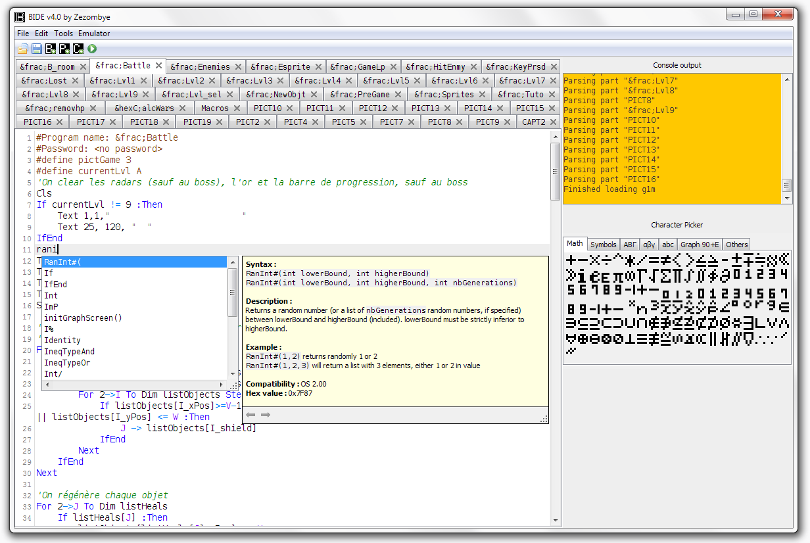
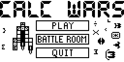
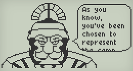
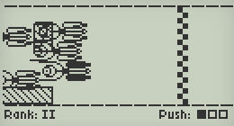
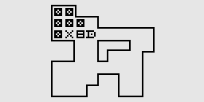
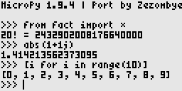
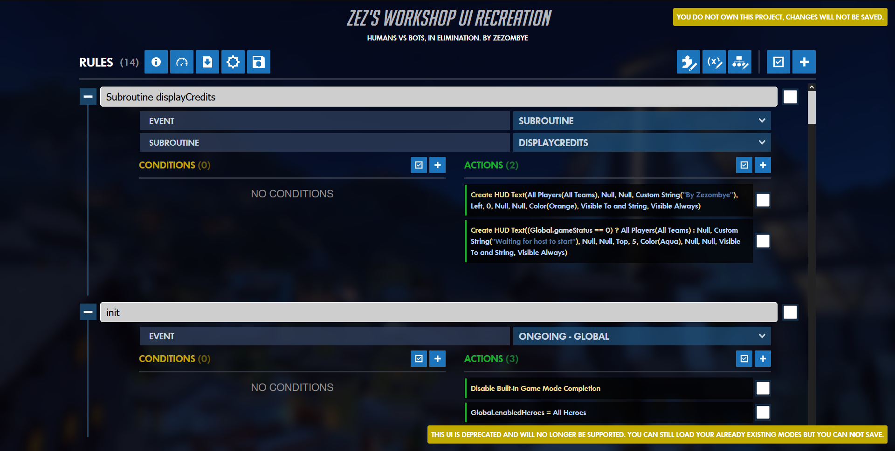
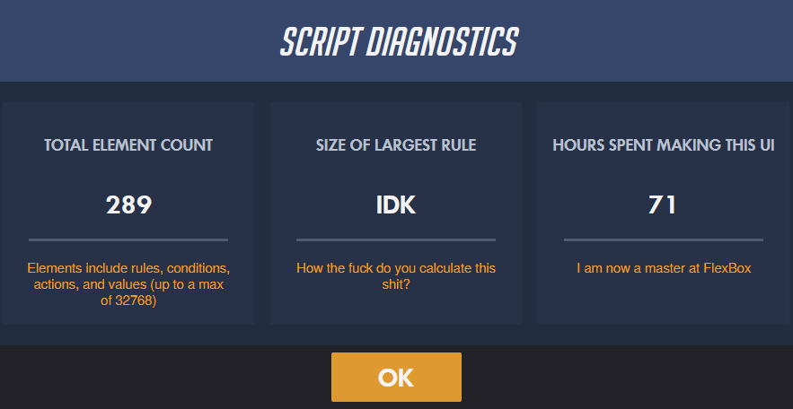

# Projects I've made

[OverPy](/overpy) and [OverWordle](/overwordle) have their respective detailed writeups and are not listed here.

## BIDE

[BIDE](https://www-planet--casio-com.translate.goog/Fr/logiciels/voir_un_logiciel_casio.php?showid=118&_x_tr_sl=fr&_x_tr_tl=en&_x_tr_hl=fr&_x_tr_pto=wapp) is an IDE I made for programming in Basic on Casio calculators.

With more than 10k downloads, it features an integrated editor for the binary monochrome picture format, a SVG-like picture generator, a character picker, as well as automatic testing on an emulator, and the usual stuff you expect from an IDE: syntax coloration, autocompletion with documentation, and editor shortcuts (undo/redo, find/replace).

As Basic programs are stored in a proprietary binary format (eg, the `RanInt#` function is represented as `0x7F87`), I've also had to write a decompiler and compiler between the text format and the binary format. I've also extended the language with much needed addons such as built-in functions or macros (as default variables have no name).

The challenges were pretty much the same as OverPy (creating a custom language with a compiler/decompiler), so I invite you to read that article for further information.

## Calc Wars

A Casio Basic game based on [Space Run](https://store.steampowered.com/app/275670/Space_Run/), built with BIDE of course.

Thanks to BIDE, I could manage to make a very complex game and pushed the Basic language to its limits, making use of various tricks (eg: achieving a scrolling effect by storing multiple pictures which weren't 128x64, causing the calculator to read the data of the next pictures), and that game got me to finally win the Casio Programming Contest, where the reward is... another calculator :D

Unfortunately, I couldn't manage to port this game to the web, but you can [check out the page here](https://www-planet--casio-com.translate.goog/Fr/programmes/programme3330-last-calc-wars-zezombye-jeux-actionsport.html?_x_tr_sl=fr&_x_tr_tl=en&_x_tr_hl=fr&_x_tr_pto=wapp).

## Chariot Wars

{inline-block} {inline-block}

Another Casio game, this time made in the C language. It also competed in the Casio Programming Contest, but unfortunately couldn't win against [Arena](https://www-planet--casio-com.translate.goog/Fr/programmes/programme3152-1-arena-lephenixnoir-jeux-add-ins.html?_x_tr_sl=fr&_x_tr_tl=en&_x_tr_hl=fr&_x_tr_pto=wapp) which used a custom-made game engine with grayscale support.

**[You can play it online](/chariotwars)**, though be aware that it is not playable on mobile/tablet.

## Sokoban

A good ol' sokoban I made in 2016, which was very handy during long math classes :D

**[Play it online!](/sokoban)**

## Caddit

A toy project where the aim was to use my phone as a router between my Casio calculator and Reddit, in order to read it (lol) during class without the teacher seeing it.

After making an Android app which parsed data from the Reddit API and sent it to the calculator via Bluetooth, making a calculator app to receive that data and display it, and a bit of soldering, it worked:

<YoutubeVideo id="https://www.youtube.com/watch?v=KWUhDGAC9Kk"/>

As you can see, it was still a bit clunky: there was no support for Unicode punctuation, only a few text-based subreddits were supported, and data was being transmitted in chunks of a few kB, requiring a manual press to load the next chunk. Still, it worked and was good enough for my purposes :)

As it was my first serious project, you can [watch my clueless journey here](https://www-planet--casio-com.translate.goog/Fr/forums/topic13709-1-surfer-sur-reddit-avec-bluetooth.html?_x_tr_sl=fr&_x_tr_tl=en&_x_tr_hl=fr&_x_tr_pto=wapp).

## CasioPython

The last of my big Casio-related projects. Back in 2018, Casio had just introduced Python on its newest calculators, but the MicroPython version was old and lacked features; most importantly, older calculators (more in use) did not have Python at all, which was a problem in math classes.

I therefore decided to port MicroPython to older calculators, figuring out how to adapt the code for the esoteric architecture and compiler (spent quite a few days adding support for floats), as well as adapting an existing text editor and creating a bare-bones shell implementation with a custom 3x6 font to make the most of the 128x64 screen.

As the aim was to be used in classrooms, I included a manual for math teachers.

This project is no longer useful (Casio updated its MicroPython port to have more features than mine, and exam mode makes it so my port cannot be used during exams), but you can still [check out the page here](https://www-planet--casio-com.translate.goog/Fr/programmes/programme3603-last-casiopython-zezombye-utilitaires-add-ins.html?_x_tr_sl=fr&_x_tr_tl=en&_x_tr_hl=fr&_x_tr_pto=wapp) if you are interested.

## Zombie Escape

The first serious gamemode I made in the Overwatch Workshop (and which prompted me to create OverPy due to how difficult it was to program via the UI).

It is a recreation of [Counter-Strike's Zombie Escape gamemode](https://www.youtube.com/watch?v=d3BXV9jxO68), where the goal is to get to the end of the map without being infected. But unlike other zombie games, zombies have a lot of health and are hard to kill; instead, bullets inflict knockback, and the map is designed so that humans have no choice but to fall back.

More than a programming challenge, this was also a game design challenge:

-  I had to figure out how to handle players leaving and joining very frequently (I thus made the knockback dependent on the ratio of humans/zombies, so it would be as challenging in a 3v9 as in a 6v6)
- I also had to make the gamemode work with Overwatch maps (Counter-Strike uses custom maps for this purpose, but there is no map editor in the Overwatch Workshop)
- Last, I had to adapt the heroes for the gamemode, removing mobility abilities and rebalancing cooldowns.

This got me to be featured on the popular YouTuber Mr. Fruit:

<YoutubeVideo id="https://www.youtube.com/watch?v=Bzs4AfklHRo"/>

<YoutubeVideo id="https://www.youtube.com/watch?v=gdKnLCyY_7I"/>

## Workshop UI

With the release of Overwatch 2, the UI was overhauled in an attempt to justify the "2" (it was still the same game). However, the Overwatch Workshop was not available in the UI form, instead being only accessible through the copy/paste buttons.

As many users were used to the UI and unfamiliar with the text format, I recreated the UI in VueJS in a near pixel-perfect way, using old videos as reference.

This UI is obsolete and has not been updated to the latest versions of the game as the actual Workshop UI is back to being available, but you can still [check it out here](https://workshop.codes/workshop-ui?uuid=4d77021d-fb54-40b8-87a7-502551d10b6e).

