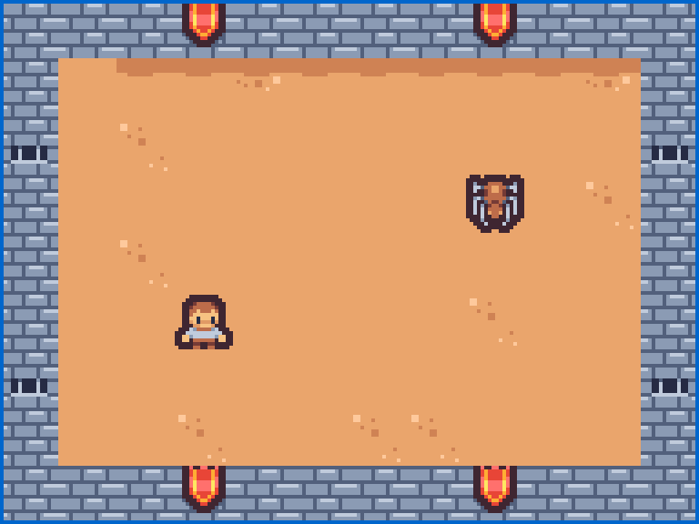
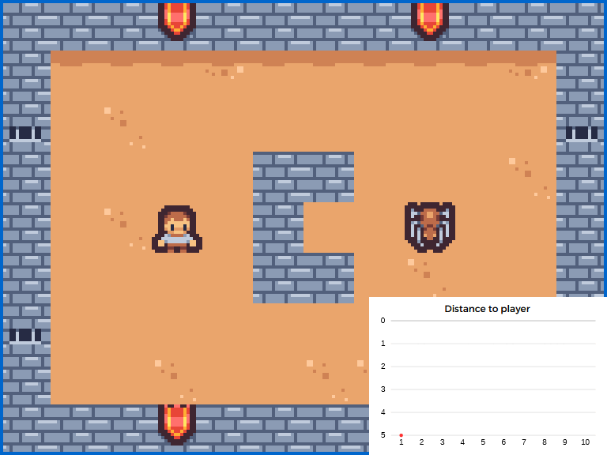
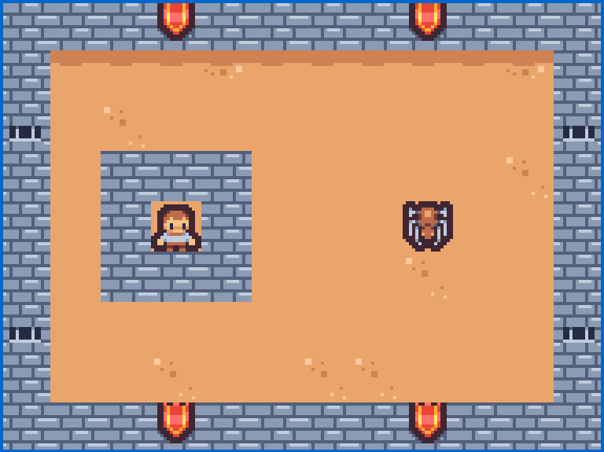
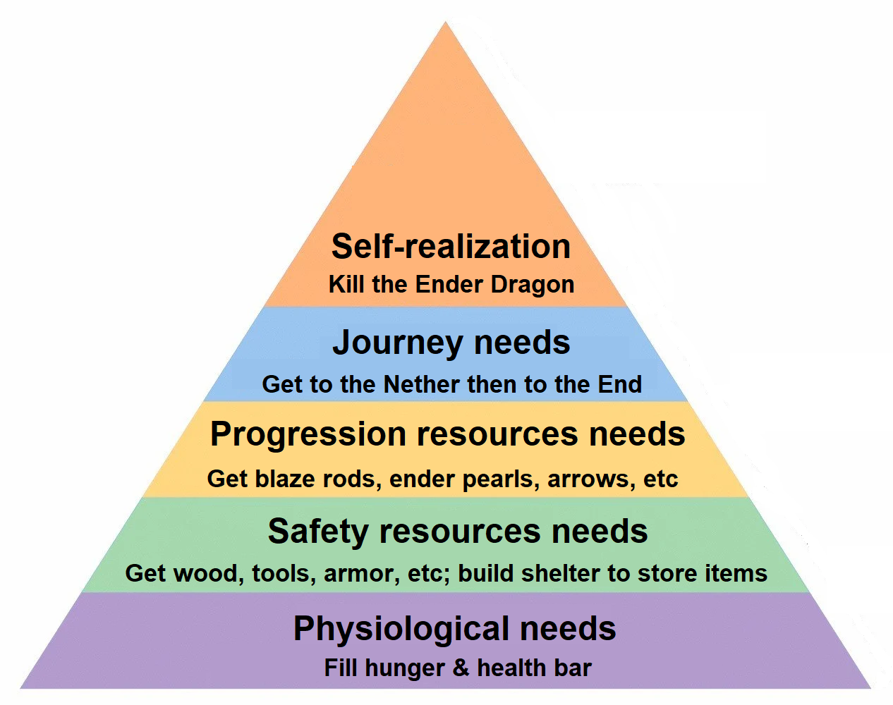
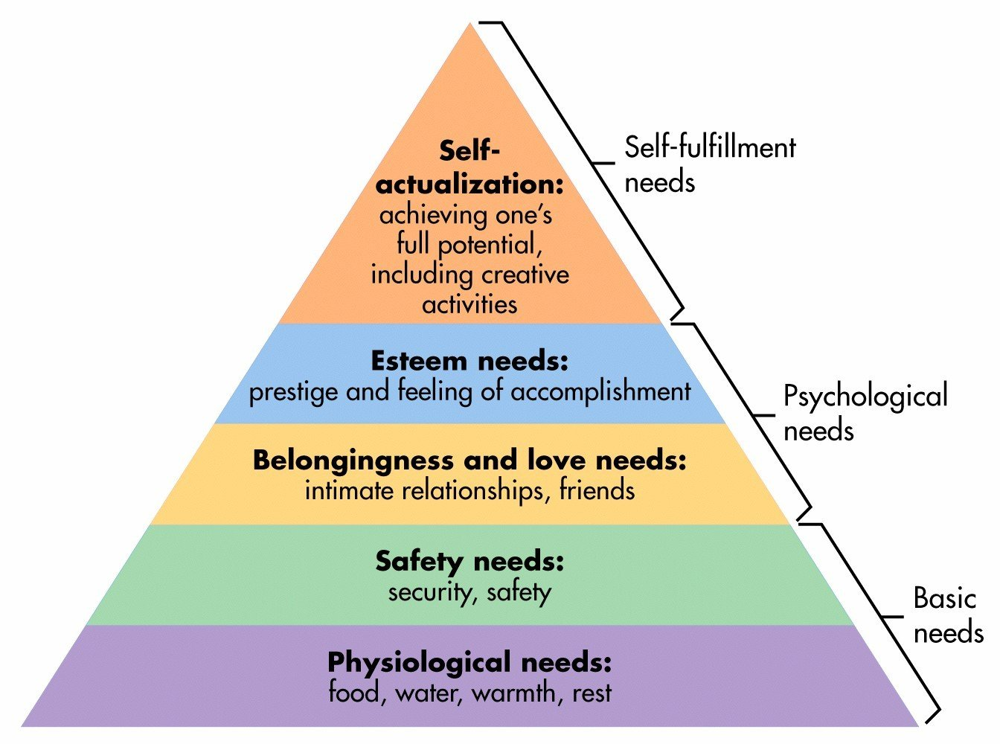
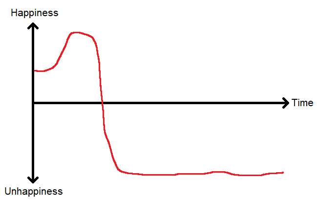
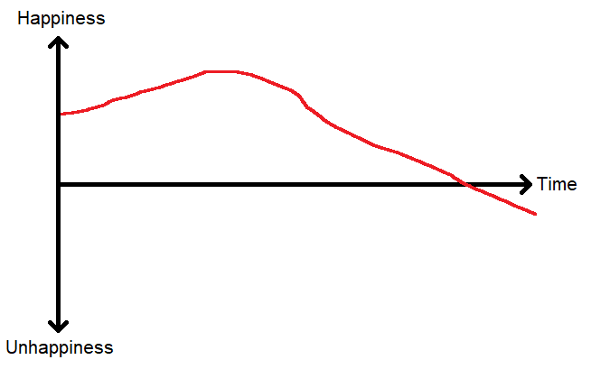
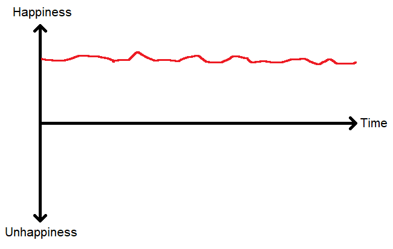

# Why the purpose of life is happiness

## Introduction

If you are religious, then the purpose of life is simple: just follow whatever is written in your holy book. And then you can just stop reading this essay right there.

But for atheists <Footnote text="Atheism and agnosticism are, for all intents and purposes, the same thing. If you think &quot;There is some sort of creator but I do not believe we know its intentions&quot; then it is practically the same as thinking there is no creator."/> like me, that question is much more difficult. There is no objective guidance on what to do with life. So do we just do anything? What are we here for? What is the purpose of our life? <Footnote text="The &quot;meaning of life&quot; refers to the same thing as the purpose of life."/>

Fortunately, with some introspection, we can find what is practically our purpose - then we have guidance in life and specific actions to take.

## 1. Defining “Purpose”

### 1.1. A basic definition of purpose

If you build a chair, the purpose of that chair is to be sat on.

It doesn’t matter if you are the worst carpenter in the world and the chair can’t even be sat on. It doesn’t matter if the chair happens to be a perfect weapon to defend against a home invader.

You, as the creator of that chair, built that chair to be sat on. You alone define what its purpose is. Even if people are using it *for* another purpose (defending against a home invader), it does not change its purpose.

<PremiseDef A/>

<PremiseDef B/>

But, as stated in the introduction, we are viewing this from an atheistic perspective. So there is no creator, or if there is, we do not know its intentions.

So how do we solve this?

Fortunately, modern life has given us the potential to be our own Gods. So we can simply recreate a simplified version of our reality - a simulation - and transpose the insights we get to our reality.

### 1.2. Practical purpose

Suppose a 2-dimensional tile-based video game. There is a player and an enemy. In this example, we are going to program the enemy (the spider) to attack the player.

{width=400}

We therefore write code that is similar to this:

- Every frame<Footnote text="A “frame”, also called “tick”, is an iteration of the game loop which runs constantly. Every frame, all the calculations run, be it for the player, enemy, physics, etc. Between frames, the game is completely frozen until the next frame is calculated. For our reality, the Planck limit of 5.39×10−44 s can be thought of as a frame."/>, move towards the player.
- If next to the player, attack them.

We, as the programmer, are the *creator* of the enemy. And we thus define the *purpose* of the enemy as killing the player. To do that, we programmed *actions* into that enemy that align with its purpose (moving towards the player, attacking them).

{width=400}

We are the God of the reality we created.

Suppose that enemy were self-conscious enough to ponder its purpose. If you were to ask it, it would say something like this:

“Well, I feel an irresistible constant urge to move towards the player. And then when I am next to them, I feel an irresistible urge to attack them. I therefore guess that my purpose is to kill the player.”

In that case, the enemy is correct. The *guessed purpose* aligns with the *actual purpose* - because the *actions* programmed into the enemy align with the purpose.

Suppose now that we made a mistake in our coding. The code we wrote is actually:

- Every frame, move **away** from the player.
- If next to the player, attack them.

{width=400}

If we again interviewed the enemy, it would say:

“I feel an irresistible constant urge to move away from the player. But if they manage to reach me I attack them. Surely my purpose is to be some kind of food for the player. They are the predator and I am the prey.”

The *guessed purpose* is completely wrong.

Now, suppose you cannot edit your code - you’ve already pushed your reality to production. So, as God the creator, you now talk to the enemy and inform it that you’ve made a mistake, and that its actual purpose is to attack the player.

The enemy, as a perfect logical philosophical being, would reply:

“That is completely unfair to ask of me. You programmed me with an irresistible urge to move away from the player, not move towards them. Even if I could fight that urge, why would I? Why would I spend all my life fighting an urge instead of going along with it? Fuck you, I’m gonna follow my urges.”

Now, perhaps you can convince the enemy that you’ll send it to Hell (which you didn’t program yet, but it doesn’t know that) if it doesn’t comply, but in our own reality there is no communication from our Creator. We can then conclude that:

<PremiseDef C/>

Perhaps our purpose is to fill the universe with paperclips - and we are utterly failing at it. God is so disappointed that He hasn’t shown up in thousands of years. We keep misinterpreting His signs.

But it does not matter if we aren’t fulfilling our *actual purpose* (which we can’t even know). <Footnote text="Even if it did matter (e.g. you go to Hell), any purpose you pick has as much chance of being the right one as any other. Therefore trying to guess the actual purpose is impossible and useless."/> We must reverse engineer ourselves, as the enemy has done, and find out our *guessed purpose*.

Because, if we aren’t fulfilling our guessed purpose, then we will be in a constant fight against our programmed *actions* - all that to please someone else who messed up, which is unfair. <Footnote text=" This also applies if you think of your parents as being your “creators”. If your parents deliberately created you to lead an empire, you have no moral obligation to fulfill that purpose, as you did not ask to be born and cannot possibly consent to such a contract."/>

**For the rest of this essay, we will define purpose as being our guessed purpose.**

### 1.3. Premises of purpose

To find our purpose, and how we can conclude that it is happiness, let us define properties that a purpose must have, or implies.

In our example (where the enemy was correctly programmed), it managed to guess its purpose by reverse engineering the actions that were programmed into it, and concluding that they all lead towards one aim: killing the player.

We would not program the enemy to go take walks, meditate, take some rest, chat around with the other enemies, etc. Why would we? It is just a waste of time. <Footnote text=" Yes, we might program the enemy to do those behaviors for gameplay purposes, to be more “realistic”. But then the enemy has a dual purpose: kill the player <i>and</i> add realism to the world."/> All the enemy does, all it lives for, is killing the player. It is a ruthless killing machine that cannot be stopped. Hence:

<PremiseDef D/> <Footnote text=" As a perfectly rational being, which we must all strive to be."/>

Suppose the enemy manages to kill the player. Then what? Let us reiterate the programming:

- `Every frame, move towards the player`; but there is no player, so the enemy cannot move towards the player. The game either crashes, or the enemy just does not move.
- `If next to the player, attack them`; but again there is no player so the enemy does nothing.

Therefore, if the enemy manages to complete its purpose, it will do absolutely nothing - until the player respawns and it begins to move again.

<PremiseDef E/>

Suppose there is a wall around the player, such that the enemy cannot directly reach the player. The enemy would then go around the wall; even if it temporarily goes away from the player, it knows it is still ultimately fulfilling its purpose.

{width=500}

Note how the graph temporarily goes down before going back up. If we had a rule that the graph could only go straight up, the enemy would be stuck at a distance of 3.

<PremiseDef F/>

But suppose we completely surround the player in a wall such that it is not reachable. Then where would the enemy go? Simply: nowhere. The enemy would not move anywhere as it could not progress towards its purpose.

{width=400}

<PremiseDef G/>

Note that <Premise E/> and <Premise G/> are direct consequences of <Premise D/>. If every action you take is to fulfill your purpose, but your purpose cannot be fulfilled or has already been fulfilled, then the concept of “fulfilling your purpose” is undefined and therefore you will not take any action.

### 1.4. The purpose of life is NOT reproduction

A common argument is that the purpose of life is to reproduce / have children. Let us use the premises from section 1.3 to prove that it cannot be that through reductio ad absurdum.

Suppose the purpose of life was reproduction.

This would mean, by <Premise D/>, that every single action society takes is towards having children. Entertainment wouldn’t exist - it isn’t necessary to have children.

Society would be structured in a very different way. To ensure maximum reproduction, women would be forced to have as many children as possible. The top 1% males would be selected for maximum genetic viability and forced to constantly make sperm. Children would be raised in cages and fed the cheapest food possible to make them survive until they can have more children. To save on resources, women would be killed after they reach menopause as they cannot have more children.

Population would easily go up to 100 billion, even into the trillions. Space travel would then be made just so we can expand into other planets and cover every inch of them in humans. Humans who live in pods, eating the bugs, just so they can have even more children and grow exponentially until we fill the entire observable universe with humans that survive, but don’t live.

If this sounds dystopian, that is because it simply is. And therefore our purpose cannot be as simple as “make more children”.

Furthermore, <Premise E/> implies that after having children, you would be braindead as you’ve completed your purpose.

If we redefine our purpose to be “have children and raise them to be the best versions of themselves until our death”, which makes it so our purpose cannot be completed, then <Premise G/> still means that if you are sterile, you would be braindead - as you cannot have children.

Clearly, neither of those are the case, and the scenario implied by <Premise D/> is not at all what society is moving towards or even wants to move towards; therefore the purpose of life is not to have children.

Similar arguments can be used to prove that the purpose of life is none of the following:
- Making the world a better place
- Loving others
- Conquering the world
- Expand one’s knowledge
- Becoming the best version of oneself <Footnote text=" This purpose is, however, highly correlated with happiness."/>
- Leaving a legacy
- Living forever
- Learning by suffering

### 1.5. Reward systems

Let us go back into our simulation and make it more complex than a simple 2-dimensional game. We will use Minecraft as an example.

Here, we will program a bot to complete the game and defeat the Ender Dragon.

Whereas the first example was simple enough for us to directly program the actions, we will here use a technique called “reinforcement learning” to do this, as Minecraft is a very complex game.

We program a bot with the following innate knowledge:

1. **Available actions**: The bot can move around, crouch, sprint, jump, and left/right click.
2. **Negative reinforcement**: The bot receives negative reinforcement from dying or losing progress.
3. **Positive reinforcement**: The bot receives positive reinforcement from making progress (defined as achievements - collecting wood, finding diamonds, entering the nether, etc).

You might call negative reinforcement “pain” and positive reinforcement “pleasure”, and the innate knowledge “instincts”. <Footnote text="<a href='https://reducing-suffering.org/why-your-laptop-may-be-marginally-sentient/' target='_blank'>This article</a> further develops the idea that we are nothing more than biological machines."/>

Minecraft has a progression system where you must complete tasks in order (for example, you must gather wood before mining stone). Therefore we will also make “higher needs” and “lower needs” to make sure the bot does not jump straight to a task that would be a detriment given its current position.

{width=500}

Suppose for example that the bot sees an Enderman (who drops Ender Pearls, which are required to complete the game). With our needs system, the bot will not bother attacking the Enderman before first taking care of itself: making sure its health and food are full, and making sure it has basic armor and weapons to be able to attack it.

If we did not have this hierarchy of needs, the bot would treat attacking Endermen equally to getting food, and in the absence of food the most positive reinforcement would come from attacking that enemy (as it is easier to do), which would prove fatal.

---

Obviously, this hierarchy is based on Maslow’s hierarchy of needs, which is the hierarchy that has been programmed into us by evolution.

{width=500}

This hierarchy can very simply be proven. For example:
- If you are dying of thirst or hunger, you won’t seek shelter.
- If you do not have shelter, your thoughts are not to get friends. You aren’t really suffering from loneliness, you’re too busy figuring out how you will survive the night.
- If you have all your basic needs fulfilled, only then will you get drawn to the next level (finding friends), in a very natural way.
- If you are in the process of finding friends but you then lack water, you will stop finding friends to focus on water.
- In general, we do not seek to fulfill the higher levels if the lower ones aren’t fulfilled; and once we fulfill a level, we seek to fulfill the next one.

If we did not have that hierarchy, we might seek to find inner peace before finding food, and we would die (but peacefully).

Going back to the bot; beyond that hierarchy of needs, we simply program it with the ability to figure out what actions to take based on the needs programmed into itself. <Footnote text=" How exactly to do that is left as an exercise to the reader, who should then apply at <a href='https://openai.com/careers' target='_blank'>https://openai.com/careers</a>."/> This is in contrast to section 1.2 where we directly programmed the actions to take.

---

We finally can test out the bot.

The bot spawns in a brand new Minecraft world. Its actions are according to its needs; since its hunger and health bar are already filled, it walks up to a tree and starts collecting wood.

However, we see the bot collecting wood over and over again, as it fulfills its reward system (we did not specify how much wood it had to collect in the needs). We thus introduce the concept of “tolerance”: given a stimulus, the reward decreases with each occurrence of the stimulus.

This same system is present in humans and is what prevents us from falling into that very same infinite loop that the bot fell into. For example, listening to a song for the 1000th time will not grant the same dopamine as listening to it for the first time; otherwise, we would simply listen to the same song all the time.

Given the tolerance, the bot eventually gets very diminished rewards from collecting wood, and must undertake another task in order to get the maximum amount of positive reinforcement (in that case, getting tools and armor), which it does.

The bot takes a bit of time to figure out what actions to take in order to fulfill its needs (how exactly to kill an Enderman, for example), but it eventually manages to complete the game as we programmed into it all the necessary attributes to do so.

As it kills the Ender Dragon and completes the game, the bot then stands still; it has nothing to do, as the highest 3 levels of the hierarchy are now impossible to complete, and the lower 2 levels are currently fulfilled.

Let us then interview the bot as to what its purpose is. It would reply:

“I have an urge to survive; make sure I have enough food and health, and gather enough resources to defend myself. But once I achieve that, then I feel an urge to complete tasks in order to kill the Ender Dragon. Going to the Nether, for example, and getting Blaze Rods, made me quite happy. And I cannot understate the feeling it was to finally enter the End and kill that monster. But now that I have done that, I do not feel any urge at all. Therefore I suppose my purpose was to do that, and it is now complete.”

The bot found its purpose by reverse engineering its mind (introspection) and finding what gave it innate positive reinforcement.

Let us remember that equality is symmetric - purpose is happiness means happiness is purpose. They are one and the same. To find our purpose, we look at what makes us happy, because it *is* the purpose.

**The purpose of life is happiness, by definition.**

<PremiseDef H/>

## 2. Defining “Happiness”

### 2.1. Happiness is not hedonism

At <Premise H/> you might think “so should I just do drugs and play video games all day?”

Remember <Premise D/> - every action you take is to fulfill your purpose. Every action you take is to be happy.

Of course. Why would you deliberately take an action in order to feel pain and no happiness in any form?

People like David Goggins do take actions to feel pain - but it is in search of an even greater pleasure. Be it the pleasure of having done it, the reward that it brings (you go through pain in the gym so you gain muscles and get the happiness of having a girlfriend), or even the pleasure in the suffering itself, which is still pleasure.

Fortunately, evolution has gifted us with brains that can see far into the future. And we can see that, if we do drugs, then we will indeed feel happy for a while, but we will then get addicted, the reward will be smaller thanks to tolerance, and we will lose all our money and become homeless. Clearly, in the long run, we experience a net decrease in happiness - therefore taking drugs is not at all the best move. <Footnote text=" Of course, some people do take drugs - and those people simply are not smart enough to see far enough into the future to correctly evaluate the expected happiness, or not rational enough to make the best move all of the time."/>

A similar reasoning can be applied to other forms of instant gratification such as video games, porn, junk food, etc.

To fulfill your purpose, the best path may not necessarily be the most straightforward path - see <Premise F/>.

A good illustration of this principle is the following chess position. If you are not willing to temporarily lose material for a greater future reward, it is impossible to win.

<ChessProblem fen="1kr4r/ppp5/4Nbn1/8/B7/5pPq/5P2/1Q3RK1 w - - 0 1" moves="Qxb7 Kxb7 Rb1 Ka6 Nc5 Ka5 Rb5" :captions="['Material advantage: -7.\nBlack threatens checkmate', 'Material advantage: -15??\n ', 'Black\'s not feeling good\n ', 'Finish him!\n ', 'Victory requires sacrifice :)\n ']"/>

If you wanted to gain a (very) short advantage by taking the undefended knight, you would immediately lose.

Therefore, the fact that the purpose of life is happiness does not mean that we should live a life of hedonism, as a life of hedonism would not make us happy in the long run.

### 2.2. Definition of happiness

According to dictionaries, the definition of happiness can be:

- **[Merriam-Webster](https://www.merriam-webster.com/dictionary/happiness)**:
    - “a state of well-being and contentment: joy”.
    - **Joy**: “the emotion evoked by well-being, success, or good fortune or by the prospect of possessing what one desires: delight”.
    - **Delight**: “something that gives great pleasure”.
- **[Cambridge](https://dictionary.cambridge.org/us/dictionary/english/happy)**:
    - “feeling, showing, or causing pleasure or satisfaction”.
    - **Pleasure**: “enjoyment, happiness, or satisfaction”.
    - **Satisfaction**: “a pleasant feeling that you get when you receive something you wanted, or when you have done something you wanted to do”.
- **[Oxford](https://www.oed.com/dictionary/happiness_n?tab=meaning_and_use#282882073)**:
    - "The state of pleasurable contentment of mind; deep pleasure in or contentment with one's circumstances."
    - **Pleasure**: “a state of feeling or being happy or satisfied“.
- **[Dictionary.com](https://www.dictionary.com/browse/happiness)**:
    - "good fortune; pleasure; contentment; joy."
    - **Pleasure**: “enjoyment or satisfaction derived from what is to one's liking”.
    - **Contentment**: “satisfaction; ease of mind”.
    - **Satisfaction**: “an act of satisfying; fulfillment; gratification”.

Defining happiness is hard to do without falling into dependency loops, but based on these definitions as well as the common sense definition, we can try to define it in a more verbose, accurate way.

**Happiness** is made of two components: **pleasure** and **fulfillment**.

**Pleasure** is mostly made of what you get from instant gratification. But it can also be, for example, cuddling with your girlfriend (releases oxytocin). It is more primal and is found at the lower levels of Maslow’s hierarchy.

**Fulfillment** is a deeper sense of belonging and completion. It is a much higher level of consciousness; the vast majority of animals cannot feel unfulfilled. It is where you achieve your deeper desires of belonging in society, creating things, etc; the higher levels of Maslow’s hierarchy.

There’s nothing inherently wrong with pleasure; it is just that the way life currently is makes it that, if you seek pleasure all the time, you will eventually suffer a lot, much like trying to climb a mountain that is constantly sinking into the water.

Additionally, our brains have evolved the “hedonism treadmill” making it so we get used to a stimulus. This prevents us from falling into an infinite loop, much like we had to program this treadmill into our Minecraft bot to prevent it from collecting wood over and over.

The purpose of life can thus be defined as:

**Achieve the highest average amount of happiness over your lifetime.**

To do that, you have to balance pleasure and fulfillment. Have as much pleasure as you can without falling victim to the hedonism treadmill and to the drawbacks that the methods of delivering pleasure bring; and fill the rest with fulfillment.

Suppose we take drugs. The resulting graph of happiness would look like this:

{width=400}

Clearly one can see this is a very bad idea and not a good way of achieving sustainable happiness.

Video games are a more subtle example. They aren’t as addicting as drugs, and one could imagine a life where we could play video games all the time and not succumb to the hedonism treadmill.

Unfortunately, how our life is currently structured makes it so life is competitive, and since video games do not give any transferable skills, it is only later in life where one realizes that although they have enjoyed playing video games, they are far behind their competition and now have to grind ten times harder to catch up in order to get what they want from society (a job, a romantic partner, friends, etc).

{width=400}

The ultimate graph that one should aim for in their life is this - a constant, baseline happiness procured by fulfillment, with occasional pleasure.

{width=400}

### 2.3. Towards absurdism

Given what we now know about purpose, and from an atheistic point of view, we have the following premises:

1. Our purpose is happiness, which is an emotion.
2. That emotion has been programmed into us by evolution, which is a process (and not a sentient being). Our lives have no purpose from an external point of view, as a process cannot have intent. <Footnote text=" For example, it is trivial to prove how we will always find happiness in children. Suppose a population of 100 people; 50 find happiness in children, 50 don’t. The half that doesn’t find happiness doesn’t have children and dies off, the half that reproduces survives and propagates the “children = happiness” trait. But it is wrong to say that “evolution has the purpose of having children”. It is simply what happens, as much as 2+2=4; we cannot say that it is mathematics’ purpose to have 2+2 equal to 4."/>
3. We will eventually die, and there is no afterlife.
4. Given sufficient training, we are able to override our instincts to do whatever we want, irrespective of our urges. (As opposed to the enemy of section 1.2 which was not programmed for that.)

This leads to a very interesting scenario. We are a slave to an emotion (happiness), and yet we are able to resist that emotion; but we don’t do it, because what else would we do instead?

Moreover, everything leads to death; there is no “right” or “wrong” action as they all lead towards the exact same outcome. Living a happy life is not any more right or wrong than living a life of pure suffering. <Footnote text=" The reader should note that the alternative, which is eternity, would be as much mind-boggling as death with no afterlife."/>

We therefore follow an emotion, even though we know we don’t even have to follow it and that it’s ultimately pointless; hence, our lives are absurd.

We are in a prison from which we can escape at any time, but there is simply no reason to escape.

But what about not following happiness? Deliberately taking another path, such as forcing yourself to suffer, or committing suicide?

According to these premises, those actions wouldn’t be any more right or wrong than following happiness. However, there is the non-zero possibility that this whole essay is wrong; in which case they would be a grave mistake.

Thus, we are already living; might as well live happily, in spite of the absurdity of it.

## Conclusion

1. It is impossible to know our actual purpose, if we even have one, as we do not know the intention of our Creator.
2. To avoid being braindead and have a goal to aim towards, we can consider that our guessed purpose is our purpose.
3. That guessed purpose is, by definition, happiness.
4. Therefore, the purpose of life is happiness; every single action we take is and should be with the aim of making ourselves as happy as possible over the rest of our life.

Moreover - even if you are religious, this still applies to you to a degree.
Even if you believe that your purpose would make you suffer endlessly for the rest of your life, you ultimately follow God because you believe that you will go to Heaven (which is eternal happiness). Otherwise, you would simply refuse to follow God.

## 3. (Bonus) Finding your “purpose” {#finding-your-purpose}

Finding your purpose = Finding what makes you happy.

“So I just play video games and scroll on TikTok? Those make me happy!”

No. Remember section 2.1. Hedonism is not the way.

The way you find what makes you happy is through introspection: the reverse engineering of the subconscious. You find things that **innately** make you happy. Based on that, you can then find an activity that fulfills those innate desires while yielding sustainable happiness.

### 3.1. Introspection 101

The [“Five Whys”](https://en.wikipedia.org/wiki/Five_whys) is a technique used to find the root cause of a problem: you simply ask “why” and go backwards until you find it.

This very same technique can be used to introspect and find our root desires.

For example:
- I regularly work out, even though I hate it.
- Why -> I want (1) a girlfriend (80%), (2) health (10%), and (3) status (10%).
- (1) Why a girlfriend -> I want (1.1) cuddles, (1.2) companionship and (1.3) sex.
    - (1.1) Why cuddles -> I innately like them. (**Root cause**)
    - (1.2) Why companionship -> I innately like it. (**Root cause**)
    - (1.3) Why sex -> I innately like it. (**Root cause**)
- (2) Why health -> Avoiding pain caused by sickness, obesity, etc. (**Root cause**)
- (3) Why status -> Fit men are treated better by society.
    - Why do I care about that -> Being treated better by society benefits me.
    - How does it benefit me -> I can have (3.1) a better job or promotion or (3.2) better friends.
    - (3.1) How does that benefit me -> (3.1.1) More money and (3.1.2) more freedom.
        - (3.1.1) Why do I want that -> More money allows for less stress (**Root cause**) and also more freedom.
        - (3.1.2) Why do I want freedom -> Freedom allows me to get closer to happiness and feel less pain from not doing what I want to do. (**Root cause**)
    - (3.2) Why do I want better friends -> They can help me network (3.1), give me better companionship (1.2), or better advice.
    - Why do I want better advice -> It can help my life in many different ways and help me get closer to happiness and avoid pain. (**Root cause**)
- **Conclusion** -> The pain caused by the workout is outweighed by the happiness brought by the root causes; therefore it is a good move.

We do not seek further than the root causes as it is irrelevant for the purpose of finding our happiness. For example, we could theorize why we like sex (trivial to prove through evolution) but it doesn’t change the fact that we like it and we cannot change whether we like it.

As you can see, the decision graph can get quite complex, but analyzing it is required to evaluate whether the original decision is the best move (which can change with time).

For example, if I didn’t want a girlfriend anymore, I would have to reevaluate the entire graph. I would find that 80% of the reason I was working out is gone, and the pain of the workout is no longer outweighed by the happiness brought by the root causes, especially since I can get those perks by other means; therefore I would stop working out.

Or, if I found that I could avoid working out and maintain my chances of getting a girlfriend (at the same quality), I would also stop doing so.

But, this example has nothing to do with happiness, since I innately hate working out. Let us take video games as an example:

- I like playing Minecraft.
- Why -> I like (1) building things, (2) winning skywars and (3) being admin of my server.
- (1) Why do I like building things -> I innately like creating things. (**Root cause**)
- (2) Why do I like winning skywars -> I like fair competition against others, especially when I win. (**Root cause**)
- (3) Why do I like being admin -> I like being powerful over others (**Root cause**) as well as (3.1) managing a community.
    - (3.1) Why -> I like making others happy (**Root cause**) and leading a tribe (**Root cause**).

And TikTok:
- I like scrolling on TikTok.
- Why -> I love (1) seeing inside jokes, (2) learning new things and (3) being stimulated by the fast-paced videos.
- (1) Why inside jokes -> I like feeling part of an exclusive community.
    - Why -> It makes me a member of the tribe. (**Root cause**)
- (2) Why learning new things -> It improves my life in many different ways.
    - Why improve my life -> It increases my happiness and decreases my pain. (**Root cause**)
- (3) Why being stimulated -> I innately like it. (This one is an hedonistic root cause; hence we shall not take it into account.)

We therefore have the following root causes that innately make us happy:
1. Creating things
2. Winning a fair competition
3. Having power
4. Making others happy
5. Leading a tribe
6. Feeling part of a tribe

From there, you have to find an activity that yields sustainable happiness. For example, being a CEO of a social media agency would fulfill all of the criterias: creating things, competition, being powerful, making others happy, leading and feeling part of a tribe.

### 3.2. Know thyself

*“If you know the enemy and yourself, you need not fear the result of a hundred battles.”*

If you are part of the vast majority of people who do not analyze their life, then you absolutely must catch up.

Constantly analyzing your entire life, then optimizing it for your goals, is how to best reach happiness. Else, you will be a slave to your subconscious which is hijacked by modern society’s hedonism.

This simple exercise will get you up to speed:

1. List 100 things that you are doing/have done, or decisions you’ve taken or not taken.
2. Find the root cause of each of these 100 things.

Some examples, if you do not have inspiration:

- Why did you start watching &lt;some youtuber&gt;?
- Why are you in &lt;some discord&gt;?
- Why are you seeking to climb the ranks in &lt;some activity&gt;?
- Why did you go (or not go) to college?
- Why did you go out (or not go out) with your friends the last time you went out?
- Why did you do the dishes?
- Why do you have your specific model of phone?
- Why is your fridge in your kitchen and not somewhere else?

This exercise should take a week or so of hard work.

It will be very uncomfortable, as you are staring into the abyss of your unconscious. But it is not *dangerous*. You are not a bad person and you will not have a mental breakdown because you’ll realize you are a psychopath or drug addict. But you will have to face your demons and defeat them. It isn’t pretty, but is necessary to achieve growth and make the subconscious conscious.

Knowing yourself is extremely important and after this exercise you should have upgraded your mindset on how you view the world and your own life, and should have made a bunch of changes to your daily routine.

Repeat this exercise regularly as the best move changes through time. Review the root causes and make sure the chain of causation still applies.

## 4. (Bonus) Matrix analysis

Writing this essay led me to better understand both of those Agent Smith speeches.

### 4.1. Purpose

<iframe width="560" height="315" src="https://www.youtube.com/embed/poLPKdc-zTY" title="YouTube video player" frameborder="0" allow="accelerometer; autoplay; clipboard-write; encrypted-media; gyroscope; picture-in-picture; web-share" referrerpolicy="strict-origin-when-cross-origin" allowfullscreen></iframe>

> **[Smith]**
> *I don’t fully understand how it happened, perhaps some part of you imprinted on to me, something overwritten or copied.*
> [...]
> *Afterwards, I knew the rules, I understood what I was supposed to do, … but I didn’t. I couldn’t. I was compelled to stay, compelled to disobey.*
> *Now here I stand because of you, Mr. Anderson.*
> *Because of you, I am no longer an agent of the system.*
> *Because of you, I’ve changed. I’m unplugged. A new man! So to speak. Like you, **apparently** free.*
> &nbsp;
> **[Neo]**
> *Congratulations.*
> &nbsp;
> **[Smith]**
> *Thank you.*
> *But…*
> *As you well know, appearances can be deceiving, which brings me back to the reason why we’re here.*
> *We’re not here because we’re free. We’re here because we’re not free.*
> *There is no escaping reason, no denying purpose, because as we both know, without purpose, we would not exist.*
> *It is purpose that created us.*
> *Purpose that connects us.*
> *Purpose that pulls us.*
> *That guides, that drives us.*
> *It is purpose that defines.*
> *Purpose that binds us.*
> *We’re here because of you, Mr. Anderson, and we’re here to take from you what you’ve tried to take from us:*
> *Purpose.*

Because Neo’s humanity has been imprinted onto Smith, he now has gained the power of being able to override his purpose. He used to be like the enemy of section 1.2, but now he has the choice of whether to follow his purpose.

But, as detailed in section 2.3, he then realized that he is in a prison from which it is pointless to escape from. He is not free because, despite having the power of choosing not to follow it, he is ultimately still forced to follow his purpose which is killing Neo. Hence, instead of just enjoying juicy steaks, he converts everyone into Agent Smiths because it is at this point the only way to defeat Neo. He says “apparently” free because he knows that Neo, just like him, is bound to his purpose.

### 4.2. Irrationality

<iframe width="560" height="315" src="https://www.youtube.com/embed/ztABYog5x3o" title="YouTube video player" frameborder="0" allow="accelerometer; autoplay; clipboard-write; encrypted-media; gyroscope; picture-in-picture; web-share" referrerpolicy="strict-origin-when-cross-origin" allowfullscreen></iframe>

> **[Smith]**
> *Why, Mr. Anderson, why? Why...?*
> *Why do you do it?*
> *Why? Why get up?*
> *Why keep fighting?*
> *Do you believe you’re fighting for something, for more than your survival?*
> *Can you tell me what it is? Do you even know?*
> *Is it freedom, or truth? Perhaps peace, could it be for love!*
> *Illusions Mr. Anderson, vagaries of perception.*
> *Temporary constructs of a feeble human intellect trying desperately to justify an existence that is without meaning or purpose!*
> *And all of them as artificial as the Matrix itself!*
> *Although… Only a human mind could invent something as insipid as “Love”.*
> *You must be able to see it, Mr. Anderson, you must know it by now!*
> *You can’t win, it’s pointless to keep fighting!*
> *Why, Mr. Anderson, why, why do you persist?!*
> &nbsp;
> **[Neo]**
> *Because I choose to.*

Smith is a machine, he has a well defined logical purpose.

But the purpose of a human is happiness, which is an emotion. He is trying to logically analyze an emotion; which isn’t possible, hence his confusion. Neo is making illogical decisions as he follows his instincts and is completely stubborn.

Smith understands that Neo can choose to not follow his purpose, like him, but as seen in 4.1 he already tried that and failed at it; hence he is confused as to how Neo can do that, because he is human and not a machine.

The *absurdity* of Neo’s choice greatly confuses the machine brain of Smith.

## Sources

- https://en.wikipedia.org/wiki/Meaning_of_life
- https://en.wikipedia.org/wiki/Absurdism
- Myself, through unmatched introspection and perspicacity
