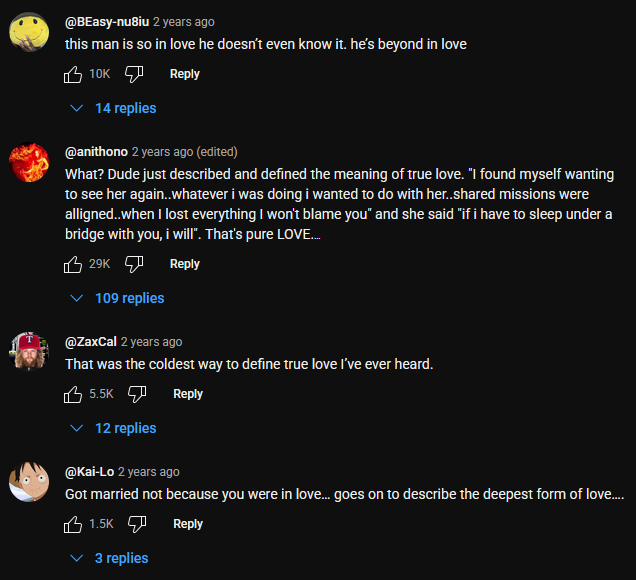

# Why I view relationships like a business

In this post, I will consider the most common case when it comes to romantic relationships: a lifelong, monogamous relationship.

The first thing to notice when thinking seriously about love is the following:

- 41% of first marriages end in divorce. (https://www.wf-lawyers.com/divorce-statistics-and-facts/)
- Given the amount of children with parents that fight all day, and the fact that “I hate my wife” is a boomer trope by now, I think it is fair to add another 40% of marriages which are unhappy (although this statistic is quite hard to measure) and who stay together for the kids, for financial reasons, or due to delusions that they can still make it work.

This gives approximately **80% of marriages that aren’t happy**.

We aren’t talking about high school weeklong relationships. We are talking about two adults (because in the West, barely anybody marries young anymore) who have made a commitment on the altar to love each other no matter what. 40% fail, another 40% don’t care enough to study basic psychology and fix their relationship.

Therefore, it is obvious to point out that **mainstream advice about love is bullshit.**

If you follow mainstream advice, you’ll get mainstream results: 80% chance of failure.

But if you start viewing love logically and treat relationships like a business, your chance of failure goes way down.

To do that, we need to abandon all cultural expectations and start from first principles.

## Co-founders, not employees

By "treating relationships like a business" I don't mean dumb corporate stuff. You may have thought of stories where a loyal employee who's been working for the company for 30 years gets fired right before retirement just because it looks good on a spreadsheet. This is not at all what I advocate for.

I am telling you to basically imagine starting a company and having someone as your co-founder. What would your partnership be like? How would you handle disagreements and conflicts? When would you compromise and when would you say something is a dealbreaker? How would you even find your co-founder and what attributes would you optimize for?

There are a lot of parallels between business partnerships and romantic relationships.

## A relationship is not a friendship, but a business partnership

Although mainstream culture treats relationships like friendships, they are much closer to a business partnership for two key reasons.

First, relationships require exclusivity; friends don’t. At one point in my life I had two “best friends”. Although this is nonsensical, it was useless to compare them as they both helped me greatly. And, if I make other friends, my best friend won’t be jealous of me doing so. Perhaps one of those other friends will reach “best friend” level too, and that will be fine.

However, you clearly cannot do that in a relationship. If you’re dating someone, you can’t flirt with other people. Whereas if you are friends with someone, you can get to know other people.

This exclusivity makes it so that you have to very carefully choose who you date. Dating someone means you have to miss out on potential opportunities, both the ones that come to you and the ones you could’ve pursued.

Second, relationships require a lifelong commitment. When you befriend someone, you don’t think about how long you’ll stay friends. If you stay friends forever, fine; if not, it’s also fine. Friends can drift apart for any reason, whether you just change as a person, or if you no longer get along.

But, assuming you get in a relationship in your 20s and die in your 80s, you are looking at **60 years of unbroken relationship**. This is something you need to plan ahead for. Imagine if you needed to find someone to be friends with for the next 60 years; you’d certainly approach things differently.

We thus have the following problem:

1. We need to find a life partner to spend 60+ years with.
2. We cannot “try out” more than one person at a time. (You can’t date 50 people at the same time then pick out the best.)

And we get the same problem in business. If you’re building a startup:
1. You need to find a co-founder to spend 5+ years with.
2. You cannot try out more than one co-founder at the same time. (Assume you limit yourself to two founders.)

This, really, is what the problem of finding love boils down to. The limiting factors are exclusivity and commitment.

This leads to the following, very obvious realizations:

#### 1. **Criterias for a romantic partner must be optimized to last 60+ years.**

This means optimizing as least as possible for appearance. Many people hold criterias like height, money, or beauty as dealbreakers. Although physical attraction is important (else we would all be bisexual), you need to make it matter at least as possible. In the end, we all grow old and wrinkle, and there is an effect you probably experienced yourself where, when you are attracted to someone, their attractiveness goes up tenfold and you only have eyes for them.

Personality and mindset are the most important traits. If they are not compatible with yours, your relationship WILL suffer and cannot last 60+ years in a happy state.

Things such as emotional stability, kindness, loyalty, maturity, conflict resolution skills, and a growth mindset are additional criterias to optimize for.

Just like, when choosing your co-founder for your startup, physical beauty won’t be an issue. It will be whether they are mature enough to handle running a business.

#### 2. **When trying out a potential romantic partner, it must be determined as soon as possible whether that partner is suitable.**

This means going through the [fundamentals](/fundamentals) as soon as possible.

A mistake most people make is not explicitly treating a relationship like it is one. The mainstream culture makes it taboo to talk about that. You must ignore it.

When onboarding your co-founder onto your startup, you discuss the following things:
- The revenue split;
- The workload split (who does what);
- The expected amount of effort each person puts;
- The direction of the business (if you disagree on what the business should be, it has to be resolved before you can continue);
- When you plan to sell, if ever;
- etc.

Those are not easy conversations, but they must be had regardless.

When you enter a potential relationship with your partner (starting at the moment you both have acknowledged your feelings for each other), you MUST discuss as soon as possible:
- What the rules of the relationship are;
- What you both are expecting from your relationship;
- What you both are planning in the future (Kids? Family? Pets? Marriage?)
- etc. (See my article on [the fundamentals](/fundamentals) for more)

Yes, this means from the very first date onwards, you have to discuss this; else you are just wasting your time and your partner’s.

You will need to know the answer to these questions eventually anyway. As we’ve proved, you need to “fail early”: if the relationship doesn’t work, you need to know it as early as possible so that you can try out another potential partner. Hence why you need to make sure you are compatible in a fundamental way before you even make sure your personalities are compatible (something that is harder to assess).

Most people do the opposite. They hang around with a potential romantic partner for months, befriending them, giving “hints”, before finally confessing. This is a complete waste of time.

## Being professional in relationships

As we’ve seen from the previous section, treating relationships professionally during the dating stage is the most optimal way to find the best partner.

The dating market is much like the job market:

- If you want to hire someone, you’ll look to your friends before posting a job offer. Trust is an important part of both a business partnership and a romantic relationship.
- Someone who has a resume and a website will go much farther than someone who doesn’t. You don't necessarily need a website, but you likely have social media. Does it reflect who you truly are and shows the best version of yourself?
- Networking is key. You’ll have a much better chance of finding someone via your group of friends than on job/dating apps.
- When Amazon makes you go through 7 interviews, they want you to fail early. Likewise, if you have to go on 7 dates before entering a relationship, make sure to fail early.

But even when you get past the fundamentals and officially enter a relationship (defined as you and your partner being romantically exclusive to each other, not as whatever labels you may give each other), the comparisons don’t stop there:

1. You still have to “stress test” the relationship to fail early. I do not mean sabotaging it; I mean making sure to look out for everything that can happen. Can you handle fights? Being away from each other for an extended period of time? Living together?

   Just like, if you hire a worker to do tasks A, B and C, you give them all 3 tasks as soon as possible. Else, maybe they will work on task A for a year, then you find that they fail at B and C, and you wasted a year trying to find a good worker.
2. In business, weekly one-on-one meetings are held between a manager and the workers. This makes it so all grievances are taken care of as soon as possible. You NEED to implement this in your relationship. Every week, meet together and discuss if everything is going well. This prevents resentment from building up, which is what truly destroys relationships.
3. Just like you sign a contract for your job, you need a “contract” for your relationship. No need for anything formal; you just need to make sure there are no hidden expectations from either party. How much time do you expect to talk together every day? How often do you have sex? Can we hang out with our friends? For each question like that, you need to find a compromise which works for both of you.

The Hormozis’ relationship is a model for me. A couple of entrepreneurs who manage to have such a strong relationship that they can pilot a $100 million company.

Alex trusts Leila so much that he nominated her as CEO of his company, while most married couples can't even trust each other with basic stuff.

<iframe width="560" height="315" src="https://www.youtube.com/embed/0WZIKVBH9Uo" title="YouTube video player" frameborder="0" allow="accelerometer; autoplay; clipboard-write; encrypted-media; gyroscope; picture-in-picture; web-share" referrerpolicy="strict-origin-when-cross-origin" allowfullscreen></iframe>

The comments speak for themselves.

## “You’ll find someone when you’ll least expect it” is bullshit

I’m doing a whole section for this because it is so obviously nonsense that it pisses me off.

The reason people say this is because they went (or they know someone who went) through the following situation:

- They tried dating for several months or even years, with no success.
- They eventually gave up and stopped trying.
- Because they no longer focused on dating, they filled their available time with other things, and worked on themselves.
- They eventually upgraded themselves enough to be naturally noticed by girls, and a relationship “just happened”.

The conclusion drawn from it is stupid. This is the same as:

- I finish high school and immediately try to apply for jobs. However, I can barely get any interview, and the few I get are at McDonald’s.
- I eventually give up and stop applying for jobs.
- Because I am no longer sending resumes and cover letters every day, I decide to work on myself and go to college.
- Once I am out of college, I get job offers straight up sent to me, and a job “just happened”.

People fail to realize that they naturally improved themselves, which led to more success in the dating market as their value went up.

Nothing good ever happens by accident. Especially something as hard as a loving lifelong relationship.

You need to be **intentional** in love.

Both of my relationships happened after a month or two of actively trying for it. Which is to be expected; just like I’d expect to find a job after a month of searching for one.

I can attest that no relationship ever “just happened” in my life. I don’t recall suddenly waking up one day with a cute girl next to me. (I’d wonder how she broke in.)

It is obviously absurd that you would achieve a goal by NOT trying to achieve that goal, be it fitness, business, or any skill; and relationships are no exception.

It’s just that the best move might not be the most direct one; perhaps, if you want to find a job, you have to study 4 years in college first.

But certainly don’t count on “it’ll happen when it’ll happen”. It’ll happen when you get your ass off and decide to work towards that goal, just like anything in life.

## Romantic love is very much conditional

And that’s a good thing.

Think of all the things you’d say when you compliment your partner. You’d talk about:

- Their looks: their smile, their hair, their eyes, etc.
- Their personality: how they’re nice, empathetic, smart, etc.
- Their mindset: they’re disciplined, hardworking, unstoppable, ambitious, etc.

If you remove all that, what's there left to compliment? What’s there left to love?

All those reasons are conditions. I love you because you’re smart -> I love you IF you’re smart. I love you IF you’re disciplined. Etc.

Obviously, you won’t suddenly stop loving your partner if they get in a rut. But if you remove all the reasons you love someone, then by definition there’s no reason to love them anymore, and so there are conditions to the love.

Mainstream views of love speak of it as being “unconditional” and you may think “damn, I longed for unconditional love”. You shouldn’t, because love being conditional is what gives it its value.

I **want** my girlfriend to love me conditionally. That way when she says “I love you” it actually *means* something. I’d think “damn, out of all people in the world, I won her love”. I would feel extremely confident.

If my girlfriend loved me unconditionally? I’d be like “eh whatever, you’d love me no matter what anyway, and you’d love me regardless of who I am. I could be a complete loser and you’d still love me. Your love is worthless”. It would be the equivalent of a participation trophy, and nobody likes those.

There has to be a reason why your partner chose you over someone else (and why you chose them over somebody else). Those reasons are conditions for your love.

“But Zez, doesn’t that make relationships very shallow?” Not if you love for the right things. Suppose I loved a girl who was a successful 100k+ youtuber. I wouldn’t love her for an arbitrary number; I’d love her for the mindset that brought her there. If she lost her channel, I’d still love her as much. However, if she said “you know what, I’m tired of being awesome, I wanna be a loser” then I would part ways.

This obviously doesn’t apply to exceptional stuff, eg if she loses her drive because of a family death or an illness. You need to apply common sense to that.

Romantic love has to be conditional on mindset and personality (things you can control), not on achievements and productivity (things you can't).

Again, this is just like businesses. If you hire someone, there are expectations. If your employee is temporarily underperforming because of some event in their life, don’t fire them (that is dumb corporate culture), help them get back on their feet. But if nothing happens and they’re just like “nah, I don’t want to do this job anymore”, and you’ve tried everything to get them back to the level you expect of them, there comes a point when you have no choice but to fire them.

So when your girlfriend asks you “would you love me if I was a worm”, the correct answer is **no**. “Worm” is chosen very carefully. The question isn’t “a lion” (associated with courage) or “a cat” (associated with cuteness). A worm has no redeemable qualities. There are no stories about worms. I’ve never seen a furry in a worm costume. “Would you love me if I was a complete worthless loser?” Obviously not, I love you BECAUSE you are NOT a worm, because you are awesome in every way.

“Loving someone no matter what” is very dangerous. It’s how you end up in an abusive relationship saying “yeah he hit me and sent me to the hospital but that’s ok because he’s been stressed lately and I’ve admittedly been a bit annoying”. Cheating, physical violence, etc must be instant dealbreakers.

Boundaries are a condition. I love you IF you don’t cheat on me, IF you respect me, etc. And boundaries are required for a healthy relationship.

We can therefore conclude that **healthy relationships are based on conditional love.**

## Love is a skill

Business partnerships are a skill. It takes skill to make two people agree on something and make hard decisions together.

Management is a whole job for a reason.

Romantic relationships are no exception. There is a great deal of science about relationships:
- How to fight properly
- How and when to compromise
- How to handle a low period
- etc

It is a skill, like any other, that can (and must) be learned.

Keep in mind that statistic: 80% of marriages are unhappy. You, as a child, probably didn’t have happy parents.

Your parents’ relationship is the only relationship in which you have a first-party view of the whole thing: the good, the bad, and the ugly. And if their relationship was bad, then you simply have no good model to base yourself off, and you will subconsciously recreate their unhealthy behaviors.

This is why you must do research about it. Realize you don’t know anything about how to make a relationship last 60+ years. (Have you even lived 60 years yet?)

Other people’s relationships are a good start, but you only know the surface of them. You don’t know if they fight daily or not. You have no idea what a healthy relationship looks like, or how to get one.

The only first-hand experience you get is your own relationships. But that takes too long. It takes a 5-year relationship to get 5 years of experience. By the time you break up, you’ve wasted 5 years and you’ll make other mistakes with your next partner.

The way to fix this is to defer to the professionals: dating coaches, who have seen thousands of relationships. Their knowledge about relationships encompasses lifetimes of experience.

The book I will forever recommend is [How To Not Die Alone](https://www.amazon.com/How-Not-Die-Alone-Surprising/dp/0349428298), written by a professional dating coach. This post’s advice is distilled from both this book as well as my own conclusions based on basic logic and first principles.

If your relationship is struggling, or if you struggle to find a life partner, then I heavily suggest you read that book, and search on the internet for the problem you’re currently having (ignoring redpill garbage, as the redpill ideology states that a monogamous lifelong relationship is impossible). You can also view my playlist: https://www.youtube.com/playlist?list=PLDS8MSVtwiPZT37BUdFbO07glh7ZXZqxY

No matter what, do keep in mind to treat relationships professionally, and not fall for the cultural bullshit surrounding them.

Mainstream approaches get the mainstream results of 80% failure rate.
