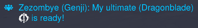

# Exploiting the Overwatch Workshop with Unicode shenanigans


Please see [my article on OverPy](/overpy) for an introduction to the Overwatch Workshop.

In this post, I will use OverPy code for easier understanding.

## The initial discovery

On September 11, 2019, Sparkette wanted to see how Overwatch handled images and colors in strings of text.


What she found was that Overwatch used a HTML-looking system of tags:

- For textures, it is simply a tag `<TX C00000000xxxxxx>` where xxxxxx is the identifier of the texture. For example, the tag `<TX C00000000007980>` would produce the "bink video" logo.
- For colors, the text is surrounded by tags of the format `<FGrrggbbaa>text</fg>`, where `rrggbbaa` is a hexadecimal color code. As such, you could make yellow text with `<FGffff00ff>`.

This is used in various places in the game, for example when displaying an ability icon in the chat:



It turns out that Overwatch allowed these tags everywhere, which allowed for the whole game browser to become quite pretty:


And we could also use those tags in the Overwatch Workshop:

{width=300}

And even in "real names", which would be displayed to your friends:


One by one, the developers fixed all the places where you could input strings. Any `<` character input by the user would be "escaped" and turned into `\<`. The rendering engine was set up in a way that, if the `<` character was preceded by a backslash, it would not display the texture. (The backslash itself wasn't displayed.)

Except it has never been truly fixed.

## The (short) revival

Texture strings are legitimately available through the Workshop, but only certain textures. By using functions such as `iconString()`{opy} or `heroIcon()`{opy}, you would get a texture tag for the chosen icon.

`print(f"{iconString(Icon.ARROW_RIGHT)} Press {abilityIconString(eventPlayer.getCurrentHero(), Button.ABILITY_1)} for hero: {heroIcon(Hero.MEI)}")`{opy}


Internally, `iconString(Icon.ARROW_RIGHT)`{opy} yields the string `"<TX C0000000001F924>"`{opy}. The above code is pretty much equivalent to:

`print("<TX C0000000001F924> Press <TX C0000000000D7D2> for hero: <TX C00000000038C2F>")`{opy}

Except that if you write it that way, it wouldn't work as the `<` characters would become `\<`.

Since these functions allow us to get access to an unescaped `<` character, if we could somehow remove the rest of the tag and replace it with our own, we could write our own tags. However, at the time this bug was first patched, it was not possible.

But in late 2020, string manipulation functions became available in the workshop. Thus, the bypass was simple: simply use `.charAt()`{opy} to extract the unescaped `<`.

```
#The .charAt() function returns the n-th character in a string, starting from 0.
#This is basically equivalent to "<TX C0000000001F924>".charAt(0) and returns "<".
holygrail = iconString(Icon.ARROW_RIGHT).charAt(0)
```

This bypass was short-lived, however, as it was patched while the update was still in the testing server. Thus `<TX>` was patched again, to users' dismay: string manipulation functions now treated tags as their own characters, meaning you could no longer split a string in the middle of a tag, or get a character in the middle of a tag, etc.

## Unicode, bytes, and characters

To truly understand how I fully bypassed the fixes, an understanding of Unicode is required.

Everything in a computer is made of numbers, and text is no exception: to represent text, you simply assign each character (letters, digits, punctuation, etc) to a number, which is called an "encoding".

Therefore, if you wanted to make an encoding and map each character to a number, an intuitive way of doing so would be:

- Assign the decimal digits (0 to 9) to their value. So the character "0" would be the number 0, the character "1" would be the number 1, etc.
- Then, assign the uppercase letters: "A" would be 10, "B" would be 11, "Z" would be 35.
- Then, assign the lowercase letters: "a" would be 36, "b" would be 37, "z" would be 61.
- Then, assign punctuation: the dot would be 62, the exclamation mark 63, etc.


But these mappings are completely arbitrary; we could put lowercase letters before uppercase letters, or change the order of the punctuation. It is crucial that people agree on an encoding system, or text would be mangled. Since only numbers can be transmitted, you need to know what character the number 10 refers to.

Americans, who pioneered computing, standardized on a single encoding, called ASCII; quite a bit more complex than our example encoding, as it contains control characters such as tab or newline.


Whereas we deal with numbers in the decimal system (10 digits: 0, 1, 2, …, 8, 9), computers deal with numbers in binary: only two digits (0 and 1), called "bits". Additionally, by convention, bits are grouped in groups of 8 called "bytes". This leads to an alternative representation of numbers: "M", which is the number 77, is represented by `01001101` in binary.

Because binary numbers can get very long and cumbersome to write, programmers often use the "hexadecimal" numbering system, which has 16 digits: 0 to 9 and A to F. By convention, the prefix "0x" is used for hexadecimal numbers.

Therefore, "M" is the number 77 in decimal, `01001101` in binary, and `0x4D` in hexadecimal. Note that those are all the same number, just different ways to write it (just like 3/2 is the same as 1.5).

The advantage of having 16 digits is because 16 is 2<sup>4</sup>, which makes it so 4 bits (binary digits) directly map to 1 hex digit, and a byte (8 bits) is represented by 2 hex digits.

When designing ASCII, Americans did not think about other languages than English. A byte is 8 bits, which can represent 2<sup>8</sup> = 256 different characters. Since all English letters, digits, and punctuation amount to about 100 different characters, ASCII simply made the mapping 1 byte = 1 character.

Thus, when internationalization became the norm, and languages such as Chinese with thousands of characters had to be supported, it became clear that one byte wouldn't be enough (as it can only represent 256 different characters). A new encoding was needed.

The easiest way would be to simply have 2 or 3 bytes per character, drastically increasing the number of possible characters (2 bytes allow for 2<sup>16</sup> = 65k characters, 3 bytes for 2<sup>24</sup> = 16 million) but this wouldn't be space efficient; it would double or triple the size of any text written in English.

The world eventually standardized on one single encoding: Unicode.

To solve the above problem, Unicode uses a variable-length encoding, called UTF-8.
ASCII only defined 128 characters (numbers 0 to 127), which means there were another 128 unassigned numbers in a byte.

Unicode made it so that, if a byte had a number above 127, it represented a multi-byte character, which could be encoded on 2, 3, or 4 bytes depending on the number assigned to the character. This also guarantees backwards compatibility with ASCII.

Therefore:
- The character "M" is assigned the number `0x4D` and is directly mapped to a byte having the same numerical value of `0x4D` (77 in decimal), as it is not above 127.
- The character "£" has the number `0xA3`, which is 163 in decimal. It is above 127, and is thus mapped to two bytes: `0xC2` and `0xA3`. (Or for short, `C2 A3`)
- The character "ඞ" has the number `0xD9E`, which is 3486 in decimal. This one is way above 127 and is mapped to three bytes: `E0 B6 9E`.

The important thing is that, although Unicode encodes characters in a variable number of bytes, **some old programming languages and developers still assume "1 character = 1 byte"**, which only remains true as long as you're dealing with English characters in Unicode.

This false assumption leads to bugs that can be exploited.

## The exploit

On September 4th, 2024, I had taken a break from the workshop for almost two years now, and up until now I had kept for myself a bypass I had found.

In the workshop, you can write strings up to 128 characters, as well as concatenate multiple strings together. But you could not concatenate indefinitely; in the end, strings were limited to 511 bytes. Like in most modern programming languages, strings use the UTF-8 encoding.

The important thing is that this limitation was enforced byte-wise, cutting the string in the middle of tags (not treating a tag as one single character). Hence, the bypass is simple:

1. Create a string with 510 1-byte characters followed by a texture tag. The texture tag will get cut off, leaving only the `<`.
2. Use the substring function to remove the first 510 chars and have access to a lone, unescaped `<` character.

```
#Declare a string called "lottabytes" with 510 1-byte characters. All English letters are 1-byte
lottaBytes = "mdsjqlfkflmdkjsqmfdljskqfqdslmjkqfsdljkqsfdmdsjqlfkflmdkjsqmfdljskqfqdslmjkqfsdljkqsfdmdsjqlfkflmdkjsqmfdljskqfqdslmjkqfsdljkqsfdmdsjqlfkflmdkjsqmfdljskqfqdslmjkqfsdljkqsfdmdsjqlfkflmdkjsqmfdljskqfqdslmjkqfsdljkqsfdmdsjqlfkflmdkjsqmfdljskqfqdslmjkqfsdljkqsfdmdsjqlfkflmdkjsqmfdljskqfqdslmjkqfsdljkqsfdmdsjqlfkflmdkjsqmfdljskqfqdslmjkqfsdljkqsfdmdsjqlfkflmdkjsqmfdljskqfqdslmjkqfsdljkqsfdmdsjqlfkflmdkjsqmfdljskqfqdslmjkqfsdljkqsfdmdsjqlfkflmdmdsjqlfkflmdkjsqmfdljskqfqdslmjkqfsdljkqsfdmdsjqlfkflmdkjsqmfdljytre"

#The following concatenates 510 bytes followed by iconString(Icon.ARROW_DOWN) which is <TX C0000000001F922>.
#The first character of the texture tag will get cut off to respect the 511 byte limit, leaving a "<".
#We then use substring(510, 1) to cut off the first 510 characters, leaving only the "<".
holygrail = f"{lottaBytes}{iconString(Icon.ARROW_DOWN)}".substring(510, 1)

#The "holygrail" variable contains an unescaped "<", and we can use it to create the <TX C00000000000003> tag.
print(f"{holygrail}TX C00000000000003>")
```

And, since I no longer cared about the workshop and it had become unmaintained anyway, I thought I might as well release the bug so users can have some fun.

I loaded up the old code I had made to test the exploit, and... it no longer worked.


I was confused. I hadn't told anybody about my exploit. Did the developers somehow patch it?

It was then that I remembered that, a year earlier, it was found that the string byte limit got removed for some reason. (I have no idea why this was the case; I doubt it was to prevent that bug, since it would've been easier to prevent cutting the string in the middle of tags instead). This explains why the "Arrow Down" icon is displayed in the above example, as it was not cut off at all.

This meant the exploit could no longer work, as I needed to somehow be able to cut off a tag in the middle, and the string byte limit was the only known way of doing so; the string functions were all useless here as they all acted on tags as their own characters.

But is string concatenation the only place where a byte limit is applied? It turns out, it isn't.

It is possible to spawn bots and name them using the `.startForcingName()`{opy} function. I had discovered long ago that those names were limited to 127 bytes, instead of the usual 511. Was this limit still there?

It was, indeed:

```
#Create a bot with the createDummy() function
createDummy(Hero.ANA, Team.ALL, 11, null, null)
#Set the bot's name to 125 "|" characters followed by 0123456789 to get the exact cutoff point
getLastCreatedEntity().startForcingName("|||||||||||||||||||||||||||||||||||||||||||||||||||||||||||||||||||||||||||||||||||||||||||||||||||||||||||||||||||||||||||||0123456789")
```


The string gets cut off after the "1", meaning the limit is indeed 125+2 = 127 bytes. To make sure it's not 127 characters, we add a two-byte character such as `é` and assert that the name is indeed cutting off one character earlier.

Therefore, this is a simple adaptation for our exploit:

1. Spawn a bot
2. Name the bot with a string with 126 1-byte characters and a texture tag
3. Put the bot's name inside a string
4. Use the substring function to remove the first 126 chars

Texture tags and newlines are removed for some reason when naming a bot (no idea why the developers don't want icons in bot names), however the function enforcing the removal has a bug where it skips the character after a replacement.

Take the string `"§blue§12§red§AB§blue§5§reset§"`{hl} for example, and suppose you made a function to remove all letters. You check all the characters one by one.
- The 1st character is `§blue§1`{hl}, which is good.
- The 2nd character is `§blue§2`{hl}, still good.
- The 3rd character is `§red§A`{hl}, so the function removes it then checks the 4th character.
- But since the 3rd character was removed from the string, all subsequent characters got shifted one position and the 4th character is `§blue§5`{hl} and not `§red§B`{hl}! The bug can be fixed by not checking the next position as long as you are removing a character.

This means we can simply get a texture in by repeating a texture twice.

```
#Create the bot
createDummy(Hero.ANA, Team.ALL, 11, null, null)
#Set the bot's name to 126 1-byte characters followed by two icons in a row
getLastCreatedEntity().startForcingName("||||||||||||||||||||||||||||||||||||||||||||||||||||||||||||||||||||||||||||||||||||||||||||||||||||||||||||||||||||||||||||||{0}{0}".format(iconString(Icon.ARROW_DOWN)))
#Set the "holygrail" variable to the bot's name
holygrail = "{}".format(getLastCreatedEntity())
#Set it to last character of the bot's name, which should be "<" as the tag got cut off
holygrail = holygrail.substring(126, 1)
print(f"{holygrail}tx C00000000000003>")
```

Let's try this, and... it doesn't work?


Interesting. Is the lone `<` character somehow escaped in a way we can't see? Let's try without the byte limit and by simply putting a texture tag in the bot's name:

```
getLastCreatedEntity().startForcingName("a{0}{0}b".format(iconString(Icon.ARROW_DOWN)))
botName = "{}".format(getLastCreatedEntity())
print(botName)
```

The icon displays in the bot name (in the killfeed), but not in the string:


This means when retrieving a bot's name and putting it into a string, it gets escaped, rendering our exploit pretty useless.

Is there really no way of using the string byte limit to its advantage?

- There are no other places where a string byte limit is enforced.
- There is no way of getting an unescaped `<` character into a string from a bot's name.

It seemed I had reached a dead end, until I remembered something else: Unicode shenanigans.

## Unicode my beloved

Unicode is so wonderfully janky that I absolutely love using it:

- Easy bypass of word filter lists with lookalike characters or zero-width spaces
- Empty or whitespace-looking strings by using one of the many invisible characters

But none of those would help us here. The Unicode exploits that we'll use are some that were popular in the 2000s, but have since been patched in pretty much every major language and library.

Overwatch rolls its own engine, and it would seem like the developers either made their own version of a UTF-8 parser, or included a wonderfully vulnerable library.

The first exploit is "byte eating". The way UTF-8 works is as follows:

- Bytes `0x00` to `0x7F` are standalone characters, for backwards compatibility with ASCII; all characters up to 127 (`0x7F`) are encoded in a single byte.
- Bytes `0xC2` to `0xDF` mark the start of a 2-byte character.
- Bytes `0xE0` to `0xEF` mark the start of a 3-byte character.
- Bytes `0xF0` to `0xF4` mark the start of a 4-byte character.
- Bytes `0x80` to `0xBF` are continuation bytes and mark the middle or the end of a multi-byte character.
- Other bytes are invalid.

Through previous experimentation, I had found that Overwatch's parser was vulnerable to this attack and that a lone start byte would "eat" the following bytes, even if they weren't valid continuation bytes. The parser would then produce the character "�" to signal an unknown character, but it is already too late: valid bytes have been eaten.

Let's create a bot with 126 1-byte chars, then a 2-byte char, which will then get cut off to produce a lone start byte:

```
#The "é" character is two bytes (C3 A9)
getLastCreatedEntity().startForcingName("||||||||||||||||||||||||||||||||||||||||||||||||||||||||||||||||||||||||||||||||||||||||||||||||||||||||||||||||||||||||||||||é")
```

By appending this start byte to a user-inputted `<` character, it "eats" the backslash and our `<` character should get unescaped. Let's try it:

```
#The last character of the bot's name is the byte 0xC3, as it got cut off.
#The string "<tx..." is actually "\<tx...". The added backslash is what prevents us from displaying the texture directly.
#By putting the 0xC3 byte before the backslash, the backslash is interpreted as the 2nd byte of a 2-byte character (as 0xC3 starts a 2-byte character) and rendered invalid.
print(f"{botName.substring(126,1)}<tx C00000000000003>")
```


It works! We finally have a working bypass. But there is an ugly square at the start. Well, let's just use `substring` to remove it:

`print(f"{botName.substring(126,1)}<tx C00000000000003>".substring(1, 999))`{opy}


It... doesn't work?

Through experimentation, we can see that `substring()`{opy} isn't falling for Unicode shenanigans and is parsing characters correctly: treating the invalid `0xC3` byte as one single character, as the byte that follows (the backslash) isn't a valid continuation byte but an ASCII character. Only the display code is vulnerable and thinks that the `0xC3` byte starts a 2-byte character.

This means we cannot get rid of the square, as we would need `substring()`{opy} to do so.

This was still a bypass, but it wasn't good enough for me. The ugly square forced the use of the fallback font on the entire string, and that fallback font isn't pretty. I wanted to find a bypass that worked flawlessly with no side effects.

## I � Unicode

There is another old exploit in Unicode, specifically UTF-8: overlong encodings.

If we convert the byte representation of a UTF-8 character to binary, we see a very clear pattern:
- 1-byte characters are represented by `0§blue§xxxxxxx`{hl}
- 2-byte characters are represented by `110§blue§xxxxx §reset§10§blue§xxxxxx`{hl}
- 3-byte characters are represented by `1110§blue§xxxx §reset§10§blue§xxxxxx §reset§10§blue§xxxxxx`{hl}
- 4-byte characters are represented by `11110§blue§xxx §reset§10§blue§xxxxxx §reset§10§blue§xxxxxx §reset§10§blue§xxxxxx`{hl}

The bits marked with `§blue§x`{hl} are then retrieved and concatenated together to form the final number. For example:
- The "ඞ" character is the number `0x0D9E`, which in binary is `1101 1001 1110`
- The UTF-8 binary representation of it is `1110§blue§0000 §reset§10§blue§110110 §reset§10§blue§011110`{hl}
- This yields `0000 1101 1001 1110` which is indeed the number in Unicode

So what if we take a 1-byte character and encode it over 3 bytes? This is called an "overlong encoding" and is an alternative representation of a character. It is normally considered an error by Unicode decoders, as it decreases security (you have to check for all possible representations of the character you want to look out for).

With any luck, Overwatch's parser was vulnerable to this; even just on the display side would be enough (and we already had proof that the parser used when displaying a string is vulnerable to a basic attack, why not the other basic attack).

As a test, I wanted to display the `A` character, for which I had found an overlong encoding on websites detailing the attack. It is best to not start with the `<` character, as it could get escaped or not rendered, making it harder to test.

We cannot get a 2-byte overlong encoding as we would need to insert `C0` or `C1` bytes; but such bytes are invalid in UTF-8, as they can _only_ be used for overlong encodings.

Using memory editing to insert those bytes could be tried, however last time I tried (4 years ago), some backend periodic process rendered the code unable to be imported after a few minutes. We thus have to use a 3-byte overlong encoding.

The overlong encoding for `A` is `E0 81 81` and thus we need 2 bots:

- The first bot will have 126 bytes followed by the `0x0840` (`E0 A1 80`) character
- The second bot will have **125** bytes followed by the `0x3041` (`E3 81 81`) character

Note that we could've chosen different characters. For the first bot, we need any character with `E0` as the first byte; for the second bot, we need any character with `81` as the 2nd byte.

```
#First bot
createDummy(Hero.ANA, Team.ALL, 11, null, null)
#\uXXXX is a way of representing a Unicode character.
#The bot will have 126 1-byte characters 0x7C ("|") followed by the 0x0840 character, encoded as E0 A1 80.
getLastCreatedEntity().startForcingName("||||||||||||||||||||||||||||||||||||||||||||||||||||||||||||||||||||||||||||||||||||||||||||||||||||||||||||||||||||||||||||||\u0840")
#botName1 should be 0xE0
botName1 = "{}".format(getLastCreatedEntity()).substring(126,1)

#Second bot
createDummy(Hero.ANA, Team.ALL, 10, null, null)
#0x3041 is a 3-byte character, encoded as E3 81 81.
#Note that this bot has 125 (instead of 126) 1-byte characters.
#This is because we need the 2nd byte of the 3-byte character, not the first byte.
getLastCreatedEntity().startForcingName("|||||||||||||||||||||||||||||||||||||||||||||||||||||||||||||||||||||||||||||||||||||||||||||||||||||||||||||||||||||||||||||\u3041")
#botName2 should be 0x81
botName2 = "{}".format(getLastCreatedEntity()).substring(126,1)

#holygrail = E0 81 81 = overlong encoding for "A"
holygrail = "{}{}{}".format(botName1, botName2, botName2)
#Should display "ATX C00000000000003>" as for now we are testing with "A" and not "<".
print("{}tx C00000000000003>".format(holygrail))
```

Try it and... doesn't work.


Was it some mistake in the bytes I used? No clue, as all I get is a square.

But this is where paying close attention comes in handy in programming. I had a debug string that showed `botName2`, and it was displaying nothing instead of a square.

That meant the string was empty, and thus that `substring()`{opy} _really_ wasn't falling for my Unicode shenanigans, as it correctly interpreted the broken 3-byte character as one character instead of two. It viewed the `E3 81` sequence of bytes as one single character, meaning `holygrail` was `E0 E3 81 E3 81` instead of `E0 81 81`. It seemed there was no way of getting a continuation byte, and thus impossible to perform the attack.

But... that is with `substring`. Let's look at the other functions we have:

- `charAt()`{opy}
- `replace()`{opy}
- `split()`{opy}

`.charAt()`{opy} didn't seem to be exploitable. But `replace()`{opy} was! Doing the equivalent of `"\xE3\x81".replace("\xE3", "")`{opy} yielded `"\x81"`{opy}. (The \x notation is to denote a raw byte)

Concatenating these 3 bytes together, we get to display `A`!

```
#First bot
createDummy(Hero.ANA, Team.ALL, 11, null, null)
getLastCreatedEntity().startForcingName("||||||||||||||||||||||||||||||||||||||||||||||||||||||||||||||||||||||||||||||||||||||||||||||||||||||||||||||||||||||||||||||\u0840")
#botName1 = E0
botName1 = "{}".format(getLastCreatedEntity()).substring(126, 1)


#Second bot
createDummy(Hero.ANA, Team.ALL, 10, null, null)
getLastCreatedEntity().startForcingName("|||||||||||||||||||||||||||||||||||||||||||||||||||||||||||||||||||||||||||||||||||||||||||||||||||||||||||||||||||||||||||||\u3041")
#botName2 = E3 81
botName2 = "{}".format(getLastCreatedEntity()).substring(125, 2)


#Third bot
createDummy(Hero.ANA, Team.ALL, 9, null, null)
getLastCreatedEntity().startForcingName("||||||||||||||||||||||||||||||||||||||||||||||||||||||||||||||||||||||||||||||||||||||||||||||||||||||||||||||||||||||||||||||\u3041")
#botName3 = E3
botName3 = "{}".format(getLastCreatedEntity()).substring(126, 1)


# botName2.replace(botName3, "")
# = "\xE3\x81".replace("\xE3, "")
# = 0x81
#holygrail = E0 81 81
holygrail = "{0}{1}{1}".format(botName1, botName2.replace(botName3, ""))
print("{}".format(holygrail))
```


The only remaining thing to do is to package up the exploit, optimize it to spawn only one bot, and use characters to create the overlong encoding for `<` instead of `A`:

```
#Final exploit that you can copy and paste into OverPy.
#Basically the same as the above except we just change the characters
globalvar holygrail
rule "By Zezombye - Setup \\<tx> bypass to get an unescaped '\\<' character":
    createDummy(getAllHeroes(), Team.1 if getNumberOfSlots(Team.1) else Team.2 if getNumberOfSlots(Team.2) else Team.ALL, vect(0,0,0), null, null)
    getLastCreatedEntity().startForcingName("______________________________________________________________________________________________________________________________\u303C")
    holygrail = f"{getLastCreatedEntity()}"
    getLastCreatedEntity().startForcingName("______________________________________________________________________________________________________________________________\u0840")
    holygrail = "______________________________________________________________________________________________________________________________\u303C".replace(holygrail, f"{getLastCreatedEntity()}").substring(126, 1)
    destroyAllDummies()

    #At this point the <tx> bypass is set up and you can use the holygrail variable to get the unescaped '<' char.
    #The following string prints "rainbow text" using the <fg> tag for color.
   print("{0}fgFF0000FF>R{0}fgFF7F00FF>a{0}fgFFFF00FF>i{0}fg00FF00FF>n{0}fg0000FFFF>b{0}fg4B0082FF>o{0}fg8B00FFFF>w{0}fgFFFFFFFF> text\n{0}tx C00000000000003>".format(holygrail))
```

And we get an unsanitized `<` character, and thus full bypass :)


In summary:

- Texture and color tags use the `<` character. However, when manually entering that character into a string, it gets escaped with a backslash `\` before it, making it impossible to display the texture as that backslash cannot be removed.
- There is no way of getting the existing unescaped `<` from the textures we have access to. We need to get a `<` character some other way.
- By exploiting the fact that bot names have a 127 byte limit, we can cut up Unicode characters and get access to their individual bytes we couldn't otherwise access.
- By using specific Unicode characters, we can get the needed bytes to "craft" the `<` character from scratch, using overlong encodings.
- The `<` character we crafted isn't escaped and we can use it to display textures and colors.
